# Step 5 deterministic graph maps

Loop status: `BLOCKED_GAUGE_KERNEL_CANDIDATE_CATALOGUE`.

## Tree 1: `W__W`

```mermaid
graph TD
  tree_1_ordered_root["W__W"]
  tree_1_ordered_term0["-1/1;sqrt2^0;i^0;K=1"]
  tree_1_ordered_root --> tree_1_ordered_term0
  tree_1_ordered_n1["COVARIANT_DERIVATIVE:nabla_+[A:UP]"]
  tree_1_ordered_term0 --> tree_1_ordered_n1
  tree_1_ordered_n2["EULER_TOKEN:G[A:UP]"]
  tree_1_ordered_n1 --> tree_1_ordered_n2
  tree_1_ordered_n3["LETTER:W[B:UP,+_nabla:DOWN,+_W:DOWN]"]
  tree_1_ordered_term0 --> tree_1_ordered_n3
  tree_1_ordered_term1["-2/1;sqrt2^0;i^1;K=1"]
  tree_1_ordered_root --> tree_1_ordered_term1
  tree_1_ordered_n4["COVARIANT_DERIVATIVE:nabla_+[A:UP]"]
  tree_1_ordered_term1 --> tree_1_ordered_n4
  tree_1_ordered_n5["COLOR_CROSS:times[A:UP]|c[C:COLOR_ADJOINT:DOWN,D:COLOR_ADJOINT:DOWN,A:COLOR_ADJOINT:UP]{0->child[0]:CONTRACT_CHILD,1->child[1]:CONTRACT_CHILD,2->output:OUTPUT_FREE}"]
  tree_1_ordered_n4 --> tree_1_ordered_n5
  tree_1_ordered_n6["BASIC_FIELD:Phi[C:UP,u:DOWN]"]
  tree_1_ordered_n5 --> tree_1_ordered_n6
  tree_1_ordered_n7["BASIC_FIELD:TildePhi[D:UP,u:DOWN]"]
  tree_1_ordered_n5 --> tree_1_ordered_n7
  tree_1_ordered_n8["LETTER:W[B:UP,+_nabla:DOWN,+_W:DOWN]"]
  tree_1_ordered_term1 --> tree_1_ordered_n8
  tree_1_ordered_term1_tensor0["c[C:COLOR_ADJOINT:DOWN,D:COLOR_ADJOINT:DOWN,A:COLOR_ADJOINT:UP]{0->child[0]:CONTRACT_CHILD,1->child[1]:CONTRACT_CHILD,2->output:OUTPUT_FREE}"]
  tree_1_ordered_term1 --> tree_1_ordered_term1_tensor0
  tree_1_ordered_term2["-1/1;sqrt2^0;i^0;K=1"]
  tree_1_ordered_root --> tree_1_ordered_term2
  tree_1_ordered_n9["LETTER:W[A:UP,+_nabla:DOWN,+_W:DOWN]"]
  tree_1_ordered_term2 --> tree_1_ordered_n9
  tree_1_ordered_n10["COVARIANT_DERIVATIVE:nabla_+[B:UP]"]
  tree_1_ordered_term2 --> tree_1_ordered_n10
  tree_1_ordered_n11["EULER_TOKEN:G[B:UP]"]
  tree_1_ordered_n10 --> tree_1_ordered_n11
  tree_1_ordered_term3["-2/1;sqrt2^0;i^1;K=1"]
  tree_1_ordered_root --> tree_1_ordered_term3
  tree_1_ordered_n12["LETTER:W[A:UP,+_nabla:DOWN,+_W:DOWN]"]
  tree_1_ordered_term3 --> tree_1_ordered_n12
  tree_1_ordered_n13["COVARIANT_DERIVATIVE:nabla_+[B:UP]"]
  tree_1_ordered_term3 --> tree_1_ordered_n13
  tree_1_ordered_n14["COLOR_CROSS:times[B:UP]|c[E:COLOR_ADJOINT:DOWN,F:COLOR_ADJOINT:DOWN,B:COLOR_ADJOINT:UP]{0->child[0]:CONTRACT_CHILD,1->child[1]:CONTRACT_CHILD,2->output:OUTPUT_FREE}"]
  tree_1_ordered_n13 --> tree_1_ordered_n14
  tree_1_ordered_n15["BASIC_FIELD:Phi[E:UP,u:DOWN]"]
  tree_1_ordered_n14 --> tree_1_ordered_n15
  tree_1_ordered_n16["BASIC_FIELD:TildePhi[F:UP,u:DOWN]"]
  tree_1_ordered_n14 --> tree_1_ordered_n16
  tree_1_ordered_term3_tensor0["c[E:COLOR_ADJOINT:DOWN,F:COLOR_ADJOINT:DOWN,B:COLOR_ADJOINT:UP]{0->child[0]:CONTRACT_CHILD,1->child[1]:CONTRACT_CHILD,2->output:OUTPUT_FREE}"]
  tree_1_ordered_term3 --> tree_1_ordered_term3_tensor0
```

Reversed fixed-index word:


## Tree 2: `W__Phi`

```mermaid
graph TD
  tree_2_ordered_root["W__Phi"]
  tree_2_ordered_term0["-1/1;sqrt2^0;i^0;K=1"]
  tree_2_ordered_root --> tree_2_ordered_term0
  tree_2_ordered_n1["COVARIANT_DERIVATIVE:nabla_+[A:UP]"]
  tree_2_ordered_term0 --> tree_2_ordered_n1
  tree_2_ordered_n2["EULER_TOKEN:G[A:UP]"]
  tree_2_ordered_n1 --> tree_2_ordered_n2
  tree_2_ordered_n3["LETTER:Phi[B:UP,s:DOWN,+_nabla:DOWN]"]
  tree_2_ordered_term0 --> tree_2_ordered_n3
  tree_2_ordered_term1["-2/1;sqrt2^0;i^1;K=1"]
  tree_2_ordered_root --> tree_2_ordered_term1
  tree_2_ordered_n4["COVARIANT_DERIVATIVE:nabla_+[A:UP]"]
  tree_2_ordered_term1 --> tree_2_ordered_n4
  tree_2_ordered_n5["COLOR_CROSS:times[A:UP]|c[C:COLOR_ADJOINT:DOWN,D:COLOR_ADJOINT:DOWN,A:COLOR_ADJOINT:UP]{0->child[0]:CONTRACT_CHILD,1->child[1]:CONTRACT_CHILD,2->output:OUTPUT_FREE}"]
  tree_2_ordered_n4 --> tree_2_ordered_n5
  tree_2_ordered_n6["BASIC_FIELD:Phi[C:UP,u:DOWN]"]
  tree_2_ordered_n5 --> tree_2_ordered_n6
  tree_2_ordered_n7["BASIC_FIELD:TildePhi[D:UP,u:DOWN]"]
  tree_2_ordered_n5 --> tree_2_ordered_n7
  tree_2_ordered_n8["LETTER:Phi[B:UP,s:DOWN,+_nabla:DOWN]"]
  tree_2_ordered_term1 --> tree_2_ordered_n8
  tree_2_ordered_term1_tensor0["c[C:COLOR_ADJOINT:DOWN,D:COLOR_ADJOINT:DOWN,A:COLOR_ADJOINT:UP]{0->child[0]:CONTRACT_CHILD,1->child[1]:CONTRACT_CHILD,2->output:OUTPUT_FREE}"]
  tree_2_ordered_term1 --> tree_2_ordered_term1_tensor0
  tree_2_ordered_term2["1/2;sqrt2^0;i^0;K=1"]
  tree_2_ordered_root --> tree_2_ordered_term2
  tree_2_ordered_n9["LETTER:W[A:UP,+_nabla:DOWN,+_W:DOWN]"]
  tree_2_ordered_term2 --> tree_2_ordered_n9
  tree_2_ordered_n10["EULER_TOKEN:TildeC[B:UP,s:DOWN]"]
  tree_2_ordered_term2 --> tree_2_ordered_n10
  tree_2_ordered_term3["-1/1;sqrt2^1;i^0;K=1"]
  tree_2_ordered_root --> tree_2_ordered_term3
  tree_2_ordered_n11["LETTER:W[A:UP,+_nabla:DOWN,+_W:DOWN]"]
  tree_2_ordered_term3 --> tree_2_ordered_n11
  tree_2_ordered_n12["COLOR_CROSS:times[B:UP]|c[E:COLOR_ADJOINT:DOWN,F:COLOR_ADJOINT:DOWN,B:COLOR_ADJOINT:UP]{0->child[0]:CONTRACT_CHILD,1->child[1]:CONTRACT_CHILD,2->output:OUTPUT_FREE}"]
  tree_2_ordered_term3 --> tree_2_ordered_n12
  tree_2_ordered_n13["BASIC_FIELD:TildePhi[E:UP,u:DOWN]"]
  tree_2_ordered_n12 --> tree_2_ordered_n13
  tree_2_ordered_n14["BASIC_FIELD:TildePhi[F:UP,v:DOWN]"]
  tree_2_ordered_n12 --> tree_2_ordered_n14
  tree_2_ordered_term3_tensor0["epsilon[s:FLAVOR:DOWN,u:FLAVOR:DOWN,v:FLAVOR:DOWN]{0->descendant_output:OUTPUT_FREE,1->cross.child[0]:EPSILON_ARGUMENT,2->cross.child[1]:EPSILON_ARGUMENT}"]
  tree_2_ordered_term3 --> tree_2_ordered_term3_tensor0
  tree_2_ordered_term3_tensor1["c[E:COLOR_ADJOINT:DOWN,F:COLOR_ADJOINT:DOWN,B:COLOR_ADJOINT:UP]{0->child[0]:CONTRACT_CHILD,1->child[1]:CONTRACT_CHILD,2->output:OUTPUT_FREE}"]
  tree_2_ordered_term3 --> tree_2_ordered_term3_tensor1
```

Reversed fixed-index word:

```mermaid
graph TD
  tree_2_reversed_root["reverse_of__W__Phi"]
  tree_2_reversed_term0["1/2;sqrt2^0;i^0;K=1"]
  tree_2_reversed_root --> tree_2_reversed_term0
  tree_2_reversed_n1["EULER_TOKEN:TildeC[B:UP,s:DOWN]"]
  tree_2_reversed_term0 --> tree_2_reversed_n1
  tree_2_reversed_n2["LETTER:W[A:UP,+_nabla:DOWN,+_W:DOWN]"]
  tree_2_reversed_term0 --> tree_2_reversed_n2
  tree_2_reversed_term1["-1/1;sqrt2^1;i^0;K=1"]
  tree_2_reversed_root --> tree_2_reversed_term1
  tree_2_reversed_n3["COLOR_CROSS:times[B:UP]|c[E:COLOR_ADJOINT:DOWN,F:COLOR_ADJOINT:DOWN,B:COLOR_ADJOINT:UP]{0->child[0]:CONTRACT_CHILD,1->child[1]:CONTRACT_CHILD,2->output:OUTPUT_FREE}"]
  tree_2_reversed_term1 --> tree_2_reversed_n3
  tree_2_reversed_n4["BASIC_FIELD:TildePhi[E:UP,u:DOWN]"]
  tree_2_reversed_n3 --> tree_2_reversed_n4
  tree_2_reversed_n5["BASIC_FIELD:TildePhi[F:UP,v:DOWN]"]
  tree_2_reversed_n3 --> tree_2_reversed_n5
  tree_2_reversed_n6["LETTER:W[A:UP,+_nabla:DOWN,+_W:DOWN]"]
  tree_2_reversed_term1 --> tree_2_reversed_n6
  tree_2_reversed_term1_tensor0["epsilon[s:FLAVOR:DOWN,u:FLAVOR:DOWN,v:FLAVOR:DOWN]{0->descendant_output:OUTPUT_FREE,1->cross.child[0]:EPSILON_ARGUMENT,2->cross.child[1]:EPSILON_ARGUMENT}"]
  tree_2_reversed_term1 --> tree_2_reversed_term1_tensor0
  tree_2_reversed_term1_tensor1["c[E:COLOR_ADJOINT:DOWN,F:COLOR_ADJOINT:DOWN,B:COLOR_ADJOINT:UP]{0->child[0]:CONTRACT_CHILD,1->child[1]:CONTRACT_CHILD,2->output:OUTPUT_FREE}"]
  tree_2_reversed_term1 --> tree_2_reversed_term1_tensor1
  tree_2_reversed_term2["1/1;sqrt2^0;i^0;K=-1"]
  tree_2_reversed_root --> tree_2_reversed_term2
  tree_2_reversed_n7["LETTER:Phi[B:UP,s:DOWN,+_nabla:DOWN]"]
  tree_2_reversed_term2 --> tree_2_reversed_n7
  tree_2_reversed_n8["COVARIANT_DERIVATIVE:nabla_+[A:UP]"]
  tree_2_reversed_term2 --> tree_2_reversed_n8
  tree_2_reversed_n9["EULER_TOKEN:G[A:UP]"]
  tree_2_reversed_n8 --> tree_2_reversed_n9
  tree_2_reversed_term3["2/1;sqrt2^0;i^1;K=-1"]
  tree_2_reversed_root --> tree_2_reversed_term3
  tree_2_reversed_n10["LETTER:Phi[B:UP,s:DOWN,+_nabla:DOWN]"]
  tree_2_reversed_term3 --> tree_2_reversed_n10
  tree_2_reversed_n11["COVARIANT_DERIVATIVE:nabla_+[A:UP]"]
  tree_2_reversed_term3 --> tree_2_reversed_n11
  tree_2_reversed_n12["COLOR_CROSS:times[A:UP]|c[C:COLOR_ADJOINT:DOWN,D:COLOR_ADJOINT:DOWN,A:COLOR_ADJOINT:UP]{0->child[0]:CONTRACT_CHILD,1->child[1]:CONTRACT_CHILD,2->output:OUTPUT_FREE}"]
  tree_2_reversed_n11 --> tree_2_reversed_n12
  tree_2_reversed_n13["BASIC_FIELD:Phi[C:UP,u:DOWN]"]
  tree_2_reversed_n12 --> tree_2_reversed_n13
  tree_2_reversed_n14["BASIC_FIELD:TildePhi[D:UP,u:DOWN]"]
  tree_2_reversed_n12 --> tree_2_reversed_n14
  tree_2_reversed_term3_tensor0["c[C:COLOR_ADJOINT:DOWN,D:COLOR_ADJOINT:DOWN,A:COLOR_ADJOINT:UP]{0->child[0]:CONTRACT_CHILD,1->child[1]:CONTRACT_CHILD,2->output:OUTPUT_FREE}"]
  tree_2_reversed_term3 --> tree_2_reversed_term3_tensor0
```

## Tree 3: `W__TildePhi`

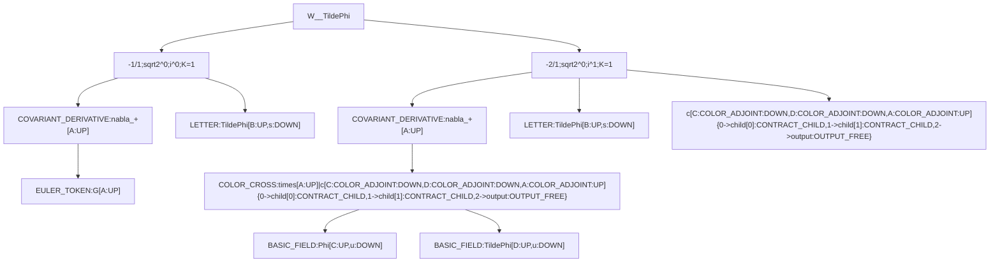

Reversed fixed-index word:

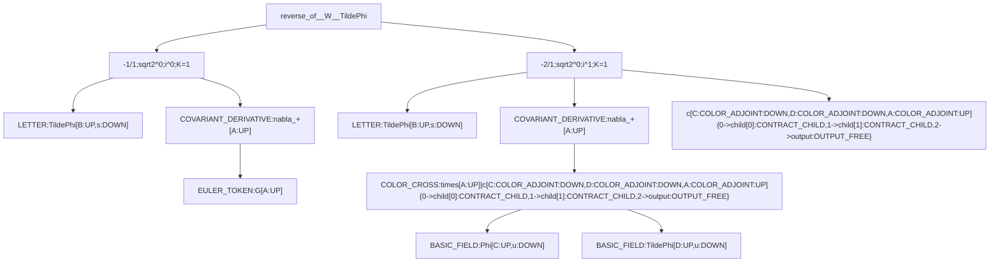

## Tree 4: `W__TildeW`

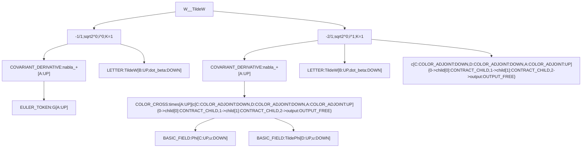

Reversed fixed-index word:

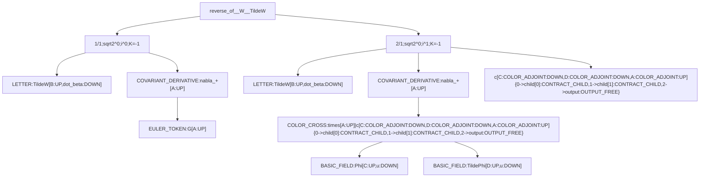

## Tree 5: `Phi__W`

```mermaid
graph TD
  tree_5_ordered_root["Phi__W"]
  tree_5_ordered_term0["1/2;sqrt2^0;i^0;K=1"]
  tree_5_ordered_root --> tree_5_ordered_term0
  tree_5_ordered_n1["EULER_TOKEN:TildeC[A:UP,r:DOWN]"]
  tree_5_ordered_term0 --> tree_5_ordered_n1
  tree_5_ordered_n2["LETTER:W[B:UP,+_nabla:DOWN,+_W:DOWN]"]
  tree_5_ordered_term0 --> tree_5_ordered_n2
  tree_5_ordered_term1["-1/1;sqrt2^1;i^0;K=1"]
  tree_5_ordered_root --> tree_5_ordered_term1
  tree_5_ordered_n3["COLOR_CROSS:times[A:UP]|c[C:COLOR_ADJOINT:DOWN,D:COLOR_ADJOINT:DOWN,A:COLOR_ADJOINT:UP]{0->child[0]:CONTRACT_CHILD,1->child[1]:CONTRACT_CHILD,2->output:OUTPUT_FREE}"]
  tree_5_ordered_term1 --> tree_5_ordered_n3
  tree_5_ordered_n4["BASIC_FIELD:TildePhi[C:UP,u:DOWN]"]
  tree_5_ordered_n3 --> tree_5_ordered_n4
  tree_5_ordered_n5["BASIC_FIELD:TildePhi[D:UP,v:DOWN]"]
  tree_5_ordered_n3 --> tree_5_ordered_n5
  tree_5_ordered_n6["LETTER:W[B:UP,+_nabla:DOWN,+_W:DOWN]"]
  tree_5_ordered_term1 --> tree_5_ordered_n6
  tree_5_ordered_term1_tensor0["epsilon[r:FLAVOR:DOWN,u:FLAVOR:DOWN,v:FLAVOR:DOWN]{0->descendant_output:OUTPUT_FREE,1->cross.child[0]:EPSILON_ARGUMENT,2->cross.child[1]:EPSILON_ARGUMENT}"]
  tree_5_ordered_term1 --> tree_5_ordered_term1_tensor0
  tree_5_ordered_term1_tensor1["c[C:COLOR_ADJOINT:DOWN,D:COLOR_ADJOINT:DOWN,A:COLOR_ADJOINT:UP]{0->child[0]:CONTRACT_CHILD,1->child[1]:CONTRACT_CHILD,2->output:OUTPUT_FREE}"]
  tree_5_ordered_term1 --> tree_5_ordered_term1_tensor1
  tree_5_ordered_term2["1/1;sqrt2^0;i^0;K=-1"]
  tree_5_ordered_root --> tree_5_ordered_term2
  tree_5_ordered_n7["LETTER:Phi[A:UP,r:DOWN,+_nabla:DOWN]"]
  tree_5_ordered_term2 --> tree_5_ordered_n7
  tree_5_ordered_n8["COVARIANT_DERIVATIVE:nabla_+[B:UP]"]
  tree_5_ordered_term2 --> tree_5_ordered_n8
  tree_5_ordered_n9["EULER_TOKEN:G[B:UP]"]
  tree_5_ordered_n8 --> tree_5_ordered_n9
  tree_5_ordered_term3["2/1;sqrt2^0;i^1;K=-1"]
  tree_5_ordered_root --> tree_5_ordered_term3
  tree_5_ordered_n10["LETTER:Phi[A:UP,r:DOWN,+_nabla:DOWN]"]
  tree_5_ordered_term3 --> tree_5_ordered_n10
  tree_5_ordered_n11["COVARIANT_DERIVATIVE:nabla_+[B:UP]"]
  tree_5_ordered_term3 --> tree_5_ordered_n11
  tree_5_ordered_n12["COLOR_CROSS:times[B:UP]|c[E:COLOR_ADJOINT:DOWN,F:COLOR_ADJOINT:DOWN,B:COLOR_ADJOINT:UP]{0->child[0]:CONTRACT_CHILD,1->child[1]:CONTRACT_CHILD,2->output:OUTPUT_FREE}"]
  tree_5_ordered_n11 --> tree_5_ordered_n12
  tree_5_ordered_n13["BASIC_FIELD:Phi[E:UP,u:DOWN]"]
  tree_5_ordered_n12 --> tree_5_ordered_n13
  tree_5_ordered_n14["BASIC_FIELD:TildePhi[F:UP,u:DOWN]"]
  tree_5_ordered_n12 --> tree_5_ordered_n14
  tree_5_ordered_term3_tensor0["c[E:COLOR_ADJOINT:DOWN,F:COLOR_ADJOINT:DOWN,B:COLOR_ADJOINT:UP]{0->child[0]:CONTRACT_CHILD,1->child[1]:CONTRACT_CHILD,2->output:OUTPUT_FREE}"]
  tree_5_ordered_term3 --> tree_5_ordered_term3_tensor0
```

Reversed fixed-index word:

```mermaid
graph TD
  tree_5_reversed_root["reverse_of__Phi__W"]
  tree_5_reversed_term0["-1/1;sqrt2^0;i^0;K=1"]
  tree_5_reversed_root --> tree_5_reversed_term0
  tree_5_reversed_n1["COVARIANT_DERIVATIVE:nabla_+[B:UP]"]
  tree_5_reversed_term0 --> tree_5_reversed_n1
  tree_5_reversed_n2["EULER_TOKEN:G[B:UP]"]
  tree_5_reversed_n1 --> tree_5_reversed_n2
  tree_5_reversed_n3["LETTER:Phi[A:UP,r:DOWN,+_nabla:DOWN]"]
  tree_5_reversed_term0 --> tree_5_reversed_n3
  tree_5_reversed_term1["-2/1;sqrt2^0;i^1;K=1"]
  tree_5_reversed_root --> tree_5_reversed_term1
  tree_5_reversed_n4["COVARIANT_DERIVATIVE:nabla_+[B:UP]"]
  tree_5_reversed_term1 --> tree_5_reversed_n4
  tree_5_reversed_n5["COLOR_CROSS:times[B:UP]|c[E:COLOR_ADJOINT:DOWN,F:COLOR_ADJOINT:DOWN,B:COLOR_ADJOINT:UP]{0->child[0]:CONTRACT_CHILD,1->child[1]:CONTRACT_CHILD,2->output:OUTPUT_FREE}"]
  tree_5_reversed_n4 --> tree_5_reversed_n5
  tree_5_reversed_n6["BASIC_FIELD:Phi[E:UP,u:DOWN]"]
  tree_5_reversed_n5 --> tree_5_reversed_n6
  tree_5_reversed_n7["BASIC_FIELD:TildePhi[F:UP,u:DOWN]"]
  tree_5_reversed_n5 --> tree_5_reversed_n7
  tree_5_reversed_n8["LETTER:Phi[A:UP,r:DOWN,+_nabla:DOWN]"]
  tree_5_reversed_term1 --> tree_5_reversed_n8
  tree_5_reversed_term1_tensor0["c[E:COLOR_ADJOINT:DOWN,F:COLOR_ADJOINT:DOWN,B:COLOR_ADJOINT:UP]{0->child[0]:CONTRACT_CHILD,1->child[1]:CONTRACT_CHILD,2->output:OUTPUT_FREE}"]
  tree_5_reversed_term1 --> tree_5_reversed_term1_tensor0
  tree_5_reversed_term2["1/2;sqrt2^0;i^0;K=1"]
  tree_5_reversed_root --> tree_5_reversed_term2
  tree_5_reversed_n9["LETTER:W[B:UP,+_nabla:DOWN,+_W:DOWN]"]
  tree_5_reversed_term2 --> tree_5_reversed_n9
  tree_5_reversed_n10["EULER_TOKEN:TildeC[A:UP,r:DOWN]"]
  tree_5_reversed_term2 --> tree_5_reversed_n10
  tree_5_reversed_term3["-1/1;sqrt2^1;i^0;K=1"]
  tree_5_reversed_root --> tree_5_reversed_term3
  tree_5_reversed_n11["LETTER:W[B:UP,+_nabla:DOWN,+_W:DOWN]"]
  tree_5_reversed_term3 --> tree_5_reversed_n11
  tree_5_reversed_n12["COLOR_CROSS:times[A:UP]|c[C:COLOR_ADJOINT:DOWN,D:COLOR_ADJOINT:DOWN,A:COLOR_ADJOINT:UP]{0->child[0]:CONTRACT_CHILD,1->child[1]:CONTRACT_CHILD,2->output:OUTPUT_FREE}"]
  tree_5_reversed_term3 --> tree_5_reversed_n12
  tree_5_reversed_n13["BASIC_FIELD:TildePhi[C:UP,u:DOWN]"]
  tree_5_reversed_n12 --> tree_5_reversed_n13
  tree_5_reversed_n14["BASIC_FIELD:TildePhi[D:UP,v:DOWN]"]
  tree_5_reversed_n12 --> tree_5_reversed_n14
  tree_5_reversed_term3_tensor0["epsilon[r:FLAVOR:DOWN,u:FLAVOR:DOWN,v:FLAVOR:DOWN]{0->descendant_output:OUTPUT_FREE,1->cross.child[0]:EPSILON_ARGUMENT,2->cross.child[1]:EPSILON_ARGUMENT}"]
  tree_5_reversed_term3 --> tree_5_reversed_term3_tensor0
  tree_5_reversed_term3_tensor1["c[C:COLOR_ADJOINT:DOWN,D:COLOR_ADJOINT:DOWN,A:COLOR_ADJOINT:UP]{0->child[0]:CONTRACT_CHILD,1->child[1]:CONTRACT_CHILD,2->output:OUTPUT_FREE}"]
  tree_5_reversed_term3 --> tree_5_reversed_term3_tensor1
```

## Tree 6: `Phi__Phi`

```mermaid
graph TD
  tree_6_ordered_root["Phi__Phi"]
  tree_6_ordered_term0["1/2;sqrt2^0;i^0;K=1"]
  tree_6_ordered_root --> tree_6_ordered_term0
  tree_6_ordered_n1["EULER_TOKEN:TildeC[A:UP,r:DOWN]"]
  tree_6_ordered_term0 --> tree_6_ordered_n1
  tree_6_ordered_n2["LETTER:Phi[B:UP,s:DOWN,+_nabla:DOWN]"]
  tree_6_ordered_term0 --> tree_6_ordered_n2
  tree_6_ordered_term1["-1/1;sqrt2^1;i^0;K=1"]
  tree_6_ordered_root --> tree_6_ordered_term1
  tree_6_ordered_n3["COLOR_CROSS:times[A:UP]|c[C:COLOR_ADJOINT:DOWN,D:COLOR_ADJOINT:DOWN,A:COLOR_ADJOINT:UP]{0->child[0]:CONTRACT_CHILD,1->child[1]:CONTRACT_CHILD,2->output:OUTPUT_FREE}"]
  tree_6_ordered_term1 --> tree_6_ordered_n3
  tree_6_ordered_n4["BASIC_FIELD:TildePhi[C:UP,u:DOWN]"]
  tree_6_ordered_n3 --> tree_6_ordered_n4
  tree_6_ordered_n5["BASIC_FIELD:TildePhi[D:UP,v:DOWN]"]
  tree_6_ordered_n3 --> tree_6_ordered_n5
  tree_6_ordered_n6["LETTER:Phi[B:UP,s:DOWN,+_nabla:DOWN]"]
  tree_6_ordered_term1 --> tree_6_ordered_n6
  tree_6_ordered_term1_tensor0["epsilon[r:FLAVOR:DOWN,u:FLAVOR:DOWN,v:FLAVOR:DOWN]{0->descendant_output:OUTPUT_FREE,1->cross.child[0]:EPSILON_ARGUMENT,2->cross.child[1]:EPSILON_ARGUMENT}"]
  tree_6_ordered_term1 --> tree_6_ordered_term1_tensor0
  tree_6_ordered_term1_tensor1["c[C:COLOR_ADJOINT:DOWN,D:COLOR_ADJOINT:DOWN,A:COLOR_ADJOINT:UP]{0->child[0]:CONTRACT_CHILD,1->child[1]:CONTRACT_CHILD,2->output:OUTPUT_FREE}"]
  tree_6_ordered_term1 --> tree_6_ordered_term1_tensor1
  tree_6_ordered_term2["-1/2;sqrt2^0;i^0;K=-1"]
  tree_6_ordered_root --> tree_6_ordered_term2
  tree_6_ordered_n7["LETTER:Phi[A:UP,r:DOWN,+_nabla:DOWN]"]
  tree_6_ordered_term2 --> tree_6_ordered_n7
  tree_6_ordered_n8["EULER_TOKEN:TildeC[B:UP,s:DOWN]"]
  tree_6_ordered_term2 --> tree_6_ordered_n8
  tree_6_ordered_term3["1/1;sqrt2^1;i^0;K=-1"]
  tree_6_ordered_root --> tree_6_ordered_term3
  tree_6_ordered_n9["LETTER:Phi[A:UP,r:DOWN,+_nabla:DOWN]"]
  tree_6_ordered_term3 --> tree_6_ordered_n9
  tree_6_ordered_n10["COLOR_CROSS:times[B:UP]|c[E:COLOR_ADJOINT:DOWN,F:COLOR_ADJOINT:DOWN,B:COLOR_ADJOINT:UP]{0->child[0]:CONTRACT_CHILD,1->child[1]:CONTRACT_CHILD,2->output:OUTPUT_FREE}"]
  tree_6_ordered_term3 --> tree_6_ordered_n10
  tree_6_ordered_n11["BASIC_FIELD:TildePhi[E:UP,u:DOWN]"]
  tree_6_ordered_n10 --> tree_6_ordered_n11
  tree_6_ordered_n12["BASIC_FIELD:TildePhi[F:UP,v:DOWN]"]
  tree_6_ordered_n10 --> tree_6_ordered_n12
  tree_6_ordered_term3_tensor0["epsilon[s:FLAVOR:DOWN,u:FLAVOR:DOWN,v:FLAVOR:DOWN]{0->descendant_output:OUTPUT_FREE,1->cross.child[0]:EPSILON_ARGUMENT,2->cross.child[1]:EPSILON_ARGUMENT}"]
  tree_6_ordered_term3 --> tree_6_ordered_term3_tensor0
  tree_6_ordered_term3_tensor1["c[E:COLOR_ADJOINT:DOWN,F:COLOR_ADJOINT:DOWN,B:COLOR_ADJOINT:UP]{0->child[0]:CONTRACT_CHILD,1->child[1]:CONTRACT_CHILD,2->output:OUTPUT_FREE}"]
  tree_6_ordered_term3 --> tree_6_ordered_term3_tensor1
```

Reversed fixed-index word:

```mermaid
graph TD
  tree_6_reversed_root["reverse_of__Phi__Phi"]
  tree_6_reversed_term0["1/2;sqrt2^0;i^0;K=1"]
  tree_6_reversed_root --> tree_6_reversed_term0
  tree_6_reversed_n1["EULER_TOKEN:TildeC[B:UP,s:DOWN]"]
  tree_6_reversed_term0 --> tree_6_reversed_n1
  tree_6_reversed_n2["LETTER:Phi[A:UP,r:DOWN,+_nabla:DOWN]"]
  tree_6_reversed_term0 --> tree_6_reversed_n2
  tree_6_reversed_term1["-1/1;sqrt2^1;i^0;K=1"]
  tree_6_reversed_root --> tree_6_reversed_term1
  tree_6_reversed_n3["COLOR_CROSS:times[B:UP]|c[E:COLOR_ADJOINT:DOWN,F:COLOR_ADJOINT:DOWN,B:COLOR_ADJOINT:UP]{0->child[0]:CONTRACT_CHILD,1->child[1]:CONTRACT_CHILD,2->output:OUTPUT_FREE}"]
  tree_6_reversed_term1 --> tree_6_reversed_n3
  tree_6_reversed_n4["BASIC_FIELD:TildePhi[E:UP,u:DOWN]"]
  tree_6_reversed_n3 --> tree_6_reversed_n4
  tree_6_reversed_n5["BASIC_FIELD:TildePhi[F:UP,v:DOWN]"]
  tree_6_reversed_n3 --> tree_6_reversed_n5
  tree_6_reversed_n6["LETTER:Phi[A:UP,r:DOWN,+_nabla:DOWN]"]
  tree_6_reversed_term1 --> tree_6_reversed_n6
  tree_6_reversed_term1_tensor0["epsilon[s:FLAVOR:DOWN,u:FLAVOR:DOWN,v:FLAVOR:DOWN]{0->descendant_output:OUTPUT_FREE,1->cross.child[0]:EPSILON_ARGUMENT,2->cross.child[1]:EPSILON_ARGUMENT}"]
  tree_6_reversed_term1 --> tree_6_reversed_term1_tensor0
  tree_6_reversed_term1_tensor1["c[E:COLOR_ADJOINT:DOWN,F:COLOR_ADJOINT:DOWN,B:COLOR_ADJOINT:UP]{0->child[0]:CONTRACT_CHILD,1->child[1]:CONTRACT_CHILD,2->output:OUTPUT_FREE}"]
  tree_6_reversed_term1 --> tree_6_reversed_term1_tensor1
  tree_6_reversed_term2["-1/2;sqrt2^0;i^0;K=-1"]
  tree_6_reversed_root --> tree_6_reversed_term2
  tree_6_reversed_n7["LETTER:Phi[B:UP,s:DOWN,+_nabla:DOWN]"]
  tree_6_reversed_term2 --> tree_6_reversed_n7
  tree_6_reversed_n8["EULER_TOKEN:TildeC[A:UP,r:DOWN]"]
  tree_6_reversed_term2 --> tree_6_reversed_n8
  tree_6_reversed_term3["1/1;sqrt2^1;i^0;K=-1"]
  tree_6_reversed_root --> tree_6_reversed_term3
  tree_6_reversed_n9["LETTER:Phi[B:UP,s:DOWN,+_nabla:DOWN]"]
  tree_6_reversed_term3 --> tree_6_reversed_n9
  tree_6_reversed_n10["COLOR_CROSS:times[A:UP]|c[C:COLOR_ADJOINT:DOWN,D:COLOR_ADJOINT:DOWN,A:COLOR_ADJOINT:UP]{0->child[0]:CONTRACT_CHILD,1->child[1]:CONTRACT_CHILD,2->output:OUTPUT_FREE}"]
  tree_6_reversed_term3 --> tree_6_reversed_n10
  tree_6_reversed_n11["BASIC_FIELD:TildePhi[C:UP,u:DOWN]"]
  tree_6_reversed_n10 --> tree_6_reversed_n11
  tree_6_reversed_n12["BASIC_FIELD:TildePhi[D:UP,v:DOWN]"]
  tree_6_reversed_n10 --> tree_6_reversed_n12
  tree_6_reversed_term3_tensor0["epsilon[r:FLAVOR:DOWN,u:FLAVOR:DOWN,v:FLAVOR:DOWN]{0->descendant_output:OUTPUT_FREE,1->cross.child[0]:EPSILON_ARGUMENT,2->cross.child[1]:EPSILON_ARGUMENT}"]
  tree_6_reversed_term3 --> tree_6_reversed_term3_tensor0
  tree_6_reversed_term3_tensor1["c[C:COLOR_ADJOINT:DOWN,D:COLOR_ADJOINT:DOWN,A:COLOR_ADJOINT:UP]{0->child[0]:CONTRACT_CHILD,1->child[1]:CONTRACT_CHILD,2->output:OUTPUT_FREE}"]
  tree_6_reversed_term3 --> tree_6_reversed_term3_tensor1
```

## Tree 7: `Phi__TildePhi`

```mermaid
graph TD
  tree_7_ordered_root["Phi__TildePhi"]
  tree_7_ordered_term0["1/2;sqrt2^0;i^0;K=1"]
  tree_7_ordered_root --> tree_7_ordered_term0
  tree_7_ordered_n1["EULER_TOKEN:TildeC[A:UP,r:DOWN]"]
  tree_7_ordered_term0 --> tree_7_ordered_n1
  tree_7_ordered_n2["LETTER:TildePhi[B:UP,s:DOWN]"]
  tree_7_ordered_term0 --> tree_7_ordered_n2
  tree_7_ordered_term1["-1/1;sqrt2^1;i^0;K=1"]
  tree_7_ordered_root --> tree_7_ordered_term1
  tree_7_ordered_n3["COLOR_CROSS:times[A:UP]|c[C:COLOR_ADJOINT:DOWN,D:COLOR_ADJOINT:DOWN,A:COLOR_ADJOINT:UP]{0->child[0]:CONTRACT_CHILD,1->child[1]:CONTRACT_CHILD,2->output:OUTPUT_FREE}"]
  tree_7_ordered_term1 --> tree_7_ordered_n3
  tree_7_ordered_n4["BASIC_FIELD:TildePhi[C:UP,u:DOWN]"]
  tree_7_ordered_n3 --> tree_7_ordered_n4
  tree_7_ordered_n5["BASIC_FIELD:TildePhi[D:UP,v:DOWN]"]
  tree_7_ordered_n3 --> tree_7_ordered_n5
  tree_7_ordered_n6["LETTER:TildePhi[B:UP,s:DOWN]"]
  tree_7_ordered_term1 --> tree_7_ordered_n6
  tree_7_ordered_term1_tensor0["epsilon[r:FLAVOR:DOWN,u:FLAVOR:DOWN,v:FLAVOR:DOWN]{0->descendant_output:OUTPUT_FREE,1->cross.child[0]:EPSILON_ARGUMENT,2->cross.child[1]:EPSILON_ARGUMENT}"]
  tree_7_ordered_term1 --> tree_7_ordered_term1_tensor0
  tree_7_ordered_term1_tensor1["c[C:COLOR_ADJOINT:DOWN,D:COLOR_ADJOINT:DOWN,A:COLOR_ADJOINT:UP]{0->child[0]:CONTRACT_CHILD,1->child[1]:CONTRACT_CHILD,2->output:OUTPUT_FREE}"]
  tree_7_ordered_term1 --> tree_7_ordered_term1_tensor1
```

Reversed fixed-index word:

```mermaid
graph TD
  tree_7_reversed_root["reverse_of__Phi__TildePhi"]
  tree_7_reversed_term0["1/2;sqrt2^0;i^0;K=1"]
  tree_7_reversed_root --> tree_7_reversed_term0
  tree_7_reversed_n1["LETTER:TildePhi[B:UP,s:DOWN]"]
  tree_7_reversed_term0 --> tree_7_reversed_n1
  tree_7_reversed_n2["EULER_TOKEN:TildeC[A:UP,r:DOWN]"]
  tree_7_reversed_term0 --> tree_7_reversed_n2
  tree_7_reversed_term1["-1/1;sqrt2^1;i^0;K=1"]
  tree_7_reversed_root --> tree_7_reversed_term1
  tree_7_reversed_n3["LETTER:TildePhi[B:UP,s:DOWN]"]
  tree_7_reversed_term1 --> tree_7_reversed_n3
  tree_7_reversed_n4["COLOR_CROSS:times[A:UP]|c[C:COLOR_ADJOINT:DOWN,D:COLOR_ADJOINT:DOWN,A:COLOR_ADJOINT:UP]{0->child[0]:CONTRACT_CHILD,1->child[1]:CONTRACT_CHILD,2->output:OUTPUT_FREE}"]
  tree_7_reversed_term1 --> tree_7_reversed_n4
  tree_7_reversed_n5["BASIC_FIELD:TildePhi[C:UP,u:DOWN]"]
  tree_7_reversed_n4 --> tree_7_reversed_n5
  tree_7_reversed_n6["BASIC_FIELD:TildePhi[D:UP,v:DOWN]"]
  tree_7_reversed_n4 --> tree_7_reversed_n6
  tree_7_reversed_term1_tensor0["epsilon[r:FLAVOR:DOWN,u:FLAVOR:DOWN,v:FLAVOR:DOWN]{0->descendant_output:OUTPUT_FREE,1->cross.child[0]:EPSILON_ARGUMENT,2->cross.child[1]:EPSILON_ARGUMENT}"]
  tree_7_reversed_term1 --> tree_7_reversed_term1_tensor0
  tree_7_reversed_term1_tensor1["c[C:COLOR_ADJOINT:DOWN,D:COLOR_ADJOINT:DOWN,A:COLOR_ADJOINT:UP]{0->child[0]:CONTRACT_CHILD,1->child[1]:CONTRACT_CHILD,2->output:OUTPUT_FREE}"]
  tree_7_reversed_term1 --> tree_7_reversed_term1_tensor1
```

## Tree 8: `Phi__TildeW`

```mermaid
graph TD
  tree_8_ordered_root["Phi__TildeW"]
  tree_8_ordered_term0["1/2;sqrt2^0;i^0;K=1"]
  tree_8_ordered_root --> tree_8_ordered_term0
  tree_8_ordered_n1["EULER_TOKEN:TildeC[A:UP,r:DOWN]"]
  tree_8_ordered_term0 --> tree_8_ordered_n1
  tree_8_ordered_n2["LETTER:TildeW[B:UP,dot_beta:DOWN]"]
  tree_8_ordered_term0 --> tree_8_ordered_n2
  tree_8_ordered_term1["-1/1;sqrt2^1;i^0;K=1"]
  tree_8_ordered_root --> tree_8_ordered_term1
  tree_8_ordered_n3["COLOR_CROSS:times[A:UP]|c[C:COLOR_ADJOINT:DOWN,D:COLOR_ADJOINT:DOWN,A:COLOR_ADJOINT:UP]{0->child[0]:CONTRACT_CHILD,1->child[1]:CONTRACT_CHILD,2->output:OUTPUT_FREE}"]
  tree_8_ordered_term1 --> tree_8_ordered_n3
  tree_8_ordered_n4["BASIC_FIELD:TildePhi[C:UP,u:DOWN]"]
  tree_8_ordered_n3 --> tree_8_ordered_n4
  tree_8_ordered_n5["BASIC_FIELD:TildePhi[D:UP,v:DOWN]"]
  tree_8_ordered_n3 --> tree_8_ordered_n5
  tree_8_ordered_n6["LETTER:TildeW[B:UP,dot_beta:DOWN]"]
  tree_8_ordered_term1 --> tree_8_ordered_n6
  tree_8_ordered_term1_tensor0["epsilon[r:FLAVOR:DOWN,u:FLAVOR:DOWN,v:FLAVOR:DOWN]{0->descendant_output:OUTPUT_FREE,1->cross.child[0]:EPSILON_ARGUMENT,2->cross.child[1]:EPSILON_ARGUMENT}"]
  tree_8_ordered_term1 --> tree_8_ordered_term1_tensor0
  tree_8_ordered_term1_tensor1["c[C:COLOR_ADJOINT:DOWN,D:COLOR_ADJOINT:DOWN,A:COLOR_ADJOINT:UP]{0->child[0]:CONTRACT_CHILD,1->child[1]:CONTRACT_CHILD,2->output:OUTPUT_FREE}"]
  tree_8_ordered_term1 --> tree_8_ordered_term1_tensor1
```

Reversed fixed-index word:

```mermaid
graph TD
  tree_8_reversed_root["reverse_of__Phi__TildeW"]
  tree_8_reversed_term0["-1/2;sqrt2^0;i^0;K=-1"]
  tree_8_reversed_root --> tree_8_reversed_term0
  tree_8_reversed_n1["LETTER:TildeW[B:UP,dot_beta:DOWN]"]
  tree_8_reversed_term0 --> tree_8_reversed_n1
  tree_8_reversed_n2["EULER_TOKEN:TildeC[A:UP,r:DOWN]"]
  tree_8_reversed_term0 --> tree_8_reversed_n2
  tree_8_reversed_term1["1/1;sqrt2^1;i^0;K=-1"]
  tree_8_reversed_root --> tree_8_reversed_term1
  tree_8_reversed_n3["LETTER:TildeW[B:UP,dot_beta:DOWN]"]
  tree_8_reversed_term1 --> tree_8_reversed_n3
  tree_8_reversed_n4["COLOR_CROSS:times[A:UP]|c[C:COLOR_ADJOINT:DOWN,D:COLOR_ADJOINT:DOWN,A:COLOR_ADJOINT:UP]{0->child[0]:CONTRACT_CHILD,1->child[1]:CONTRACT_CHILD,2->output:OUTPUT_FREE}"]
  tree_8_reversed_term1 --> tree_8_reversed_n4
  tree_8_reversed_n5["BASIC_FIELD:TildePhi[C:UP,u:DOWN]"]
  tree_8_reversed_n4 --> tree_8_reversed_n5
  tree_8_reversed_n6["BASIC_FIELD:TildePhi[D:UP,v:DOWN]"]
  tree_8_reversed_n4 --> tree_8_reversed_n6
  tree_8_reversed_term1_tensor0["epsilon[r:FLAVOR:DOWN,u:FLAVOR:DOWN,v:FLAVOR:DOWN]{0->descendant_output:OUTPUT_FREE,1->cross.child[0]:EPSILON_ARGUMENT,2->cross.child[1]:EPSILON_ARGUMENT}"]
  tree_8_reversed_term1 --> tree_8_reversed_term1_tensor0
  tree_8_reversed_term1_tensor1["c[C:COLOR_ADJOINT:DOWN,D:COLOR_ADJOINT:DOWN,A:COLOR_ADJOINT:UP]{0->child[0]:CONTRACT_CHILD,1->child[1]:CONTRACT_CHILD,2->output:OUTPUT_FREE}"]
  tree_8_reversed_term1 --> tree_8_reversed_term1_tensor1
```

## Tree 9: `TildePhi__W`

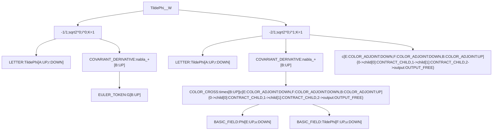

Reversed fixed-index word:

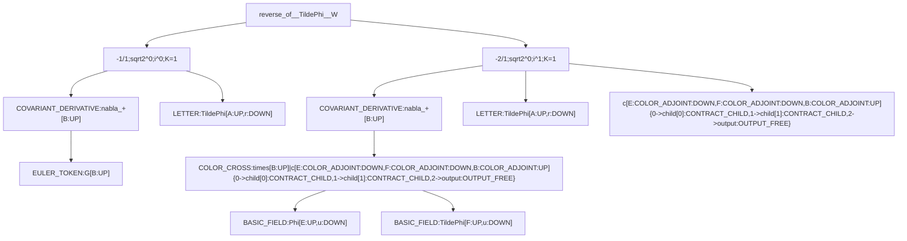

## Tree 10: `TildePhi__Phi`

```mermaid
graph TD
  tree_10_ordered_root["TildePhi__Phi"]
  tree_10_ordered_term0["1/2;sqrt2^0;i^0;K=1"]
  tree_10_ordered_root --> tree_10_ordered_term0
  tree_10_ordered_n1["LETTER:TildePhi[A:UP,r:DOWN]"]
  tree_10_ordered_term0 --> tree_10_ordered_n1
  tree_10_ordered_n2["EULER_TOKEN:TildeC[B:UP,s:DOWN]"]
  tree_10_ordered_term0 --> tree_10_ordered_n2
  tree_10_ordered_term1["-1/1;sqrt2^1;i^0;K=1"]
  tree_10_ordered_root --> tree_10_ordered_term1
  tree_10_ordered_n3["LETTER:TildePhi[A:UP,r:DOWN]"]
  tree_10_ordered_term1 --> tree_10_ordered_n3
  tree_10_ordered_n4["COLOR_CROSS:times[B:UP]|c[E:COLOR_ADJOINT:DOWN,F:COLOR_ADJOINT:DOWN,B:COLOR_ADJOINT:UP]{0->child[0]:CONTRACT_CHILD,1->child[1]:CONTRACT_CHILD,2->output:OUTPUT_FREE}"]
  tree_10_ordered_term1 --> tree_10_ordered_n4
  tree_10_ordered_n5["BASIC_FIELD:TildePhi[E:UP,u:DOWN]"]
  tree_10_ordered_n4 --> tree_10_ordered_n5
  tree_10_ordered_n6["BASIC_FIELD:TildePhi[F:UP,v:DOWN]"]
  tree_10_ordered_n4 --> tree_10_ordered_n6
  tree_10_ordered_term1_tensor0["epsilon[s:FLAVOR:DOWN,u:FLAVOR:DOWN,v:FLAVOR:DOWN]{0->descendant_output:OUTPUT_FREE,1->cross.child[0]:EPSILON_ARGUMENT,2->cross.child[1]:EPSILON_ARGUMENT}"]
  tree_10_ordered_term1 --> tree_10_ordered_term1_tensor0
  tree_10_ordered_term1_tensor1["c[E:COLOR_ADJOINT:DOWN,F:COLOR_ADJOINT:DOWN,B:COLOR_ADJOINT:UP]{0->child[0]:CONTRACT_CHILD,1->child[1]:CONTRACT_CHILD,2->output:OUTPUT_FREE}"]
  tree_10_ordered_term1 --> tree_10_ordered_term1_tensor1
```

Reversed fixed-index word:

```mermaid
graph TD
  tree_10_reversed_root["reverse_of__TildePhi__Phi"]
  tree_10_reversed_term0["1/2;sqrt2^0;i^0;K=1"]
  tree_10_reversed_root --> tree_10_reversed_term0
  tree_10_reversed_n1["EULER_TOKEN:TildeC[B:UP,s:DOWN]"]
  tree_10_reversed_term0 --> tree_10_reversed_n1
  tree_10_reversed_n2["LETTER:TildePhi[A:UP,r:DOWN]"]
  tree_10_reversed_term0 --> tree_10_reversed_n2
  tree_10_reversed_term1["-1/1;sqrt2^1;i^0;K=1"]
  tree_10_reversed_root --> tree_10_reversed_term1
  tree_10_reversed_n3["COLOR_CROSS:times[B:UP]|c[E:COLOR_ADJOINT:DOWN,F:COLOR_ADJOINT:DOWN,B:COLOR_ADJOINT:UP]{0->child[0]:CONTRACT_CHILD,1->child[1]:CONTRACT_CHILD,2->output:OUTPUT_FREE}"]
  tree_10_reversed_term1 --> tree_10_reversed_n3
  tree_10_reversed_n4["BASIC_FIELD:TildePhi[E:UP,u:DOWN]"]
  tree_10_reversed_n3 --> tree_10_reversed_n4
  tree_10_reversed_n5["BASIC_FIELD:TildePhi[F:UP,v:DOWN]"]
  tree_10_reversed_n3 --> tree_10_reversed_n5
  tree_10_reversed_n6["LETTER:TildePhi[A:UP,r:DOWN]"]
  tree_10_reversed_term1 --> tree_10_reversed_n6
  tree_10_reversed_term1_tensor0["epsilon[s:FLAVOR:DOWN,u:FLAVOR:DOWN,v:FLAVOR:DOWN]{0->descendant_output:OUTPUT_FREE,1->cross.child[0]:EPSILON_ARGUMENT,2->cross.child[1]:EPSILON_ARGUMENT}"]
  tree_10_reversed_term1 --> tree_10_reversed_term1_tensor0
  tree_10_reversed_term1_tensor1["c[E:COLOR_ADJOINT:DOWN,F:COLOR_ADJOINT:DOWN,B:COLOR_ADJOINT:UP]{0->child[0]:CONTRACT_CHILD,1->child[1]:CONTRACT_CHILD,2->output:OUTPUT_FREE}"]
  tree_10_reversed_term1 --> tree_10_reversed_term1_tensor1
```

## Tree 11: `TildePhi__TildePhi`

```mermaid
graph TD
  tree_11_ordered_root["TildePhi__TildePhi"]
  tree_11_ordered_zero["EXACT_ZERO_TREE_AST"]
  tree_11_ordered_root --> tree_11_ordered_zero
```

Reversed fixed-index word:

```mermaid
graph TD
  tree_11_reversed_root["reverse_of__TildePhi__TildePhi"]
  tree_11_reversed_zero["EXACT_ZERO_TREE_AST"]
  tree_11_reversed_root --> tree_11_reversed_zero
```

## Tree 12: `TildePhi__TildeW`

```mermaid
graph TD
  tree_12_ordered_root["TildePhi__TildeW"]
  tree_12_ordered_zero["EXACT_ZERO_TREE_AST"]
  tree_12_ordered_root --> tree_12_ordered_zero
```

Reversed fixed-index word:

```mermaid
graph TD
  tree_12_reversed_root["reverse_of__TildePhi__TildeW"]
  tree_12_reversed_zero["EXACT_ZERO_TREE_AST"]
  tree_12_reversed_root --> tree_12_reversed_zero
```

## Tree 13: `TildeW__W`

```mermaid
graph TD
  tree_13_ordered_root["TildeW__W"]
  tree_13_ordered_term0["1/1;sqrt2^0;i^0;K=-1"]
  tree_13_ordered_root --> tree_13_ordered_term0
  tree_13_ordered_n1["LETTER:TildeW[A:UP,dot_alpha:DOWN]"]
  tree_13_ordered_term0 --> tree_13_ordered_n1
  tree_13_ordered_n2["COVARIANT_DERIVATIVE:nabla_+[B:UP]"]
  tree_13_ordered_term0 --> tree_13_ordered_n2
  tree_13_ordered_n3["EULER_TOKEN:G[B:UP]"]
  tree_13_ordered_n2 --> tree_13_ordered_n3
  tree_13_ordered_term1["2/1;sqrt2^0;i^1;K=-1"]
  tree_13_ordered_root --> tree_13_ordered_term1
  tree_13_ordered_n4["LETTER:TildeW[A:UP,dot_alpha:DOWN]"]
  tree_13_ordered_term1 --> tree_13_ordered_n4
  tree_13_ordered_n5["COVARIANT_DERIVATIVE:nabla_+[B:UP]"]
  tree_13_ordered_term1 --> tree_13_ordered_n5
  tree_13_ordered_n6["COLOR_CROSS:times[B:UP]|c[E:COLOR_ADJOINT:DOWN,F:COLOR_ADJOINT:DOWN,B:COLOR_ADJOINT:UP]{0->child[0]:CONTRACT_CHILD,1->child[1]:CONTRACT_CHILD,2->output:OUTPUT_FREE}"]
  tree_13_ordered_n5 --> tree_13_ordered_n6
  tree_13_ordered_n7["BASIC_FIELD:Phi[E:UP,u:DOWN]"]
  tree_13_ordered_n6 --> tree_13_ordered_n7
  tree_13_ordered_n8["BASIC_FIELD:TildePhi[F:UP,u:DOWN]"]
  tree_13_ordered_n6 --> tree_13_ordered_n8
  tree_13_ordered_term1_tensor0["c[E:COLOR_ADJOINT:DOWN,F:COLOR_ADJOINT:DOWN,B:COLOR_ADJOINT:UP]{0->child[0]:CONTRACT_CHILD,1->child[1]:CONTRACT_CHILD,2->output:OUTPUT_FREE}"]
  tree_13_ordered_term1 --> tree_13_ordered_term1_tensor0
```

Reversed fixed-index word:

```mermaid
graph TD
  tree_13_reversed_root["reverse_of__TildeW__W"]
  tree_13_reversed_term0["-1/1;sqrt2^0;i^0;K=1"]
  tree_13_reversed_root --> tree_13_reversed_term0
  tree_13_reversed_n1["COVARIANT_DERIVATIVE:nabla_+[B:UP]"]
  tree_13_reversed_term0 --> tree_13_reversed_n1
  tree_13_reversed_n2["EULER_TOKEN:G[B:UP]"]
  tree_13_reversed_n1 --> tree_13_reversed_n2
  tree_13_reversed_n3["LETTER:TildeW[A:UP,dot_alpha:DOWN]"]
  tree_13_reversed_term0 --> tree_13_reversed_n3
  tree_13_reversed_term1["-2/1;sqrt2^0;i^1;K=1"]
  tree_13_reversed_root --> tree_13_reversed_term1
  tree_13_reversed_n4["COVARIANT_DERIVATIVE:nabla_+[B:UP]"]
  tree_13_reversed_term1 --> tree_13_reversed_n4
  tree_13_reversed_n5["COLOR_CROSS:times[B:UP]|c[E:COLOR_ADJOINT:DOWN,F:COLOR_ADJOINT:DOWN,B:COLOR_ADJOINT:UP]{0->child[0]:CONTRACT_CHILD,1->child[1]:CONTRACT_CHILD,2->output:OUTPUT_FREE}"]
  tree_13_reversed_n4 --> tree_13_reversed_n5
  tree_13_reversed_n6["BASIC_FIELD:Phi[E:UP,u:DOWN]"]
  tree_13_reversed_n5 --> tree_13_reversed_n6
  tree_13_reversed_n7["BASIC_FIELD:TildePhi[F:UP,u:DOWN]"]
  tree_13_reversed_n5 --> tree_13_reversed_n7
  tree_13_reversed_n8["LETTER:TildeW[A:UP,dot_alpha:DOWN]"]
  tree_13_reversed_term1 --> tree_13_reversed_n8
  tree_13_reversed_term1_tensor0["c[E:COLOR_ADJOINT:DOWN,F:COLOR_ADJOINT:DOWN,B:COLOR_ADJOINT:UP]{0->child[0]:CONTRACT_CHILD,1->child[1]:CONTRACT_CHILD,2->output:OUTPUT_FREE}"]
  tree_13_reversed_term1 --> tree_13_reversed_term1_tensor0
```

## Tree 14: `TildeW__Phi`

```mermaid
graph TD
  tree_14_ordered_root["TildeW__Phi"]
  tree_14_ordered_term0["-1/2;sqrt2^0;i^0;K=-1"]
  tree_14_ordered_root --> tree_14_ordered_term0
  tree_14_ordered_n1["LETTER:TildeW[A:UP,dot_alpha:DOWN]"]
  tree_14_ordered_term0 --> tree_14_ordered_n1
  tree_14_ordered_n2["EULER_TOKEN:TildeC[B:UP,s:DOWN]"]
  tree_14_ordered_term0 --> tree_14_ordered_n2
  tree_14_ordered_term1["1/1;sqrt2^1;i^0;K=-1"]
  tree_14_ordered_root --> tree_14_ordered_term1
  tree_14_ordered_n3["LETTER:TildeW[A:UP,dot_alpha:DOWN]"]
  tree_14_ordered_term1 --> tree_14_ordered_n3
  tree_14_ordered_n4["COLOR_CROSS:times[B:UP]|c[E:COLOR_ADJOINT:DOWN,F:COLOR_ADJOINT:DOWN,B:COLOR_ADJOINT:UP]{0->child[0]:CONTRACT_CHILD,1->child[1]:CONTRACT_CHILD,2->output:OUTPUT_FREE}"]
  tree_14_ordered_term1 --> tree_14_ordered_n4
  tree_14_ordered_n5["BASIC_FIELD:TildePhi[E:UP,u:DOWN]"]
  tree_14_ordered_n4 --> tree_14_ordered_n5
  tree_14_ordered_n6["BASIC_FIELD:TildePhi[F:UP,v:DOWN]"]
  tree_14_ordered_n4 --> tree_14_ordered_n6
  tree_14_ordered_term1_tensor0["epsilon[s:FLAVOR:DOWN,u:FLAVOR:DOWN,v:FLAVOR:DOWN]{0->descendant_output:OUTPUT_FREE,1->cross.child[0]:EPSILON_ARGUMENT,2->cross.child[1]:EPSILON_ARGUMENT}"]
  tree_14_ordered_term1 --> tree_14_ordered_term1_tensor0
  tree_14_ordered_term1_tensor1["c[E:COLOR_ADJOINT:DOWN,F:COLOR_ADJOINT:DOWN,B:COLOR_ADJOINT:UP]{0->child[0]:CONTRACT_CHILD,1->child[1]:CONTRACT_CHILD,2->output:OUTPUT_FREE}"]
  tree_14_ordered_term1 --> tree_14_ordered_term1_tensor1
```

Reversed fixed-index word:

```mermaid
graph TD
  tree_14_reversed_root["reverse_of__TildeW__Phi"]
  tree_14_reversed_term0["1/2;sqrt2^0;i^0;K=1"]
  tree_14_reversed_root --> tree_14_reversed_term0
  tree_14_reversed_n1["EULER_TOKEN:TildeC[B:UP,s:DOWN]"]
  tree_14_reversed_term0 --> tree_14_reversed_n1
  tree_14_reversed_n2["LETTER:TildeW[A:UP,dot_alpha:DOWN]"]
  tree_14_reversed_term0 --> tree_14_reversed_n2
  tree_14_reversed_term1["-1/1;sqrt2^1;i^0;K=1"]
  tree_14_reversed_root --> tree_14_reversed_term1
  tree_14_reversed_n3["COLOR_CROSS:times[B:UP]|c[E:COLOR_ADJOINT:DOWN,F:COLOR_ADJOINT:DOWN,B:COLOR_ADJOINT:UP]{0->child[0]:CONTRACT_CHILD,1->child[1]:CONTRACT_CHILD,2->output:OUTPUT_FREE}"]
  tree_14_reversed_term1 --> tree_14_reversed_n3
  tree_14_reversed_n4["BASIC_FIELD:TildePhi[E:UP,u:DOWN]"]
  tree_14_reversed_n3 --> tree_14_reversed_n4
  tree_14_reversed_n5["BASIC_FIELD:TildePhi[F:UP,v:DOWN]"]
  tree_14_reversed_n3 --> tree_14_reversed_n5
  tree_14_reversed_n6["LETTER:TildeW[A:UP,dot_alpha:DOWN]"]
  tree_14_reversed_term1 --> tree_14_reversed_n6
  tree_14_reversed_term1_tensor0["epsilon[s:FLAVOR:DOWN,u:FLAVOR:DOWN,v:FLAVOR:DOWN]{0->descendant_output:OUTPUT_FREE,1->cross.child[0]:EPSILON_ARGUMENT,2->cross.child[1]:EPSILON_ARGUMENT}"]
  tree_14_reversed_term1 --> tree_14_reversed_term1_tensor0
  tree_14_reversed_term1_tensor1["c[E:COLOR_ADJOINT:DOWN,F:COLOR_ADJOINT:DOWN,B:COLOR_ADJOINT:UP]{0->child[0]:CONTRACT_CHILD,1->child[1]:CONTRACT_CHILD,2->output:OUTPUT_FREE}"]
  tree_14_reversed_term1 --> tree_14_reversed_term1_tensor1
```

## Tree 15: `TildeW__TildePhi`

```mermaid
graph TD
  tree_15_ordered_root["TildeW__TildePhi"]
  tree_15_ordered_zero["EXACT_ZERO_TREE_AST"]
  tree_15_ordered_root --> tree_15_ordered_zero
```

Reversed fixed-index word:

```mermaid
graph TD
  tree_15_reversed_root["reverse_of__TildeW__TildePhi"]
  tree_15_reversed_zero["EXACT_ZERO_TREE_AST"]
  tree_15_reversed_root --> tree_15_reversed_zero
```

## Tree 16: `TildeW__TildeW`

```mermaid
graph TD
  tree_16_ordered_root["TildeW__TildeW"]
  tree_16_ordered_zero["EXACT_ZERO_TREE_AST"]
  tree_16_ordered_root --> tree_16_ordered_zero
```

Reversed fixed-index word:

```mermaid
graph TD
  tree_16_reversed_root["reverse_of__TildeW__TildeW"]
  tree_16_reversed_zero["EXACT_ZERO_TREE_AST"]
  tree_16_reversed_root --> tree_16_reversed_zero
```

## Generic blocked topology fixtures

### `generic_blocked_triangle_fixture__direct`

Status: `BLOCKED_NOT_ADMITTED_AMPLITUDE`.

Ordinary Mermaid:

```mermaid
graph LR
  I["I:EULER_CHART_TRANSPORT_FIXTURE"]
  A1["A1:ACTION_CANDIDATE"]
  A2["A2:ACTION_CANDIDATE"]
  X_OUT_D["OUT_D:p1"]
  X_OUT_D --> A1
  X_OUT_E["OUT_E:p2"]
  X_OUT_E --> A2
  I -->|"eI1:k0"| A1
  A1 -->|"e12:k0-p1"| A2
  A2 -->|"e2I:k0-p1-p2"| I
```

Ordinary DOT:

```dot
digraph "ordinary__generic_blocked_triangle_fixture__direct" {
  "I" [label="I:EULER_CHART_TRANSPORT_FIXTURE"];
  "A1" [label="A1:ACTION_CANDIDATE"];
  "A2" [label="A2:ACTION_CANDIDATE"];
  "X_OUT_D" [shape=box,label="OUT_D:p1"];
  "X_OUT_D" -> "A1";
  "X_OUT_E" [shape=box,label="OUT_E:p2"];
  "X_OUT_E" -> "A2";
  "I" -> "A1" [label="eI1:k0"];
  "A1" -> "A2" [label="e12:k0-p1"];
  "A2" -> "I" [label="e2I:k0-p1-p2"];
}
```

Supergraph Mermaid:

```mermaid
graph LR
  I["I:EULER_CHART_TRANSPORT_FIXTURE"]
  A1["A1:ACTION_CANDIDATE"]
  A2["A2:ACTION_CANDIDATE"]
  X_OUT_D["OUT_D:D[+] OUTGOING_FIELD_UNRESOLVED(p1)"]
  X_OUT_D -- "a1x{identity}" --> A1
  X_OUT_E["OUT_E:D[+] OUTGOING_FIELD_UNRESOLVED(p2)"]
  X_OUT_E -- "a2x{identity}" --> A2
  I -->|"eI1:BLOCKED_VECTOR_WICK_KERNEL(k0);i0{identity};a10{identity}"| A1
  A1 -->|"e12:BLOCKED_VECTOR_WICK_KERNEL(k0-p1);a11{identity};a20{identity}"| A2
  A2 -->|"e2I:BLOCKED_VECTOR_WICK_KERNEL(k0-p1-p2);a21{identity};i1{identity}"| I
```

Supergraph DOT:

```dot
digraph "generic_blocked_triangle_fixture__direct" {
  "I" [label="I:EULER_CHART_TRANSPORT_FIXTURE"];
  "A1" [label="A1:ACTION_CANDIDATE"];
  "A2" [label="A2:ACTION_CANDIDATE"];
  "X_OUT_D" [shape=box,label="OUT_D:D[+] OUTGOING_FIELD_UNRESOLVED(p1)"];
  "X_OUT_D" -> "A1" [label="a1x{identity}"];
  "X_OUT_E" [shape=box,label="OUT_E:D[+] OUTGOING_FIELD_UNRESOLVED(p2)"];
  "X_OUT_E" -> "A2" [label="a2x{identity}"];
  "I" -> "A1" [dir=forward,label="eI1:BLOCKED_VECTOR_WICK_KERNEL(k0);i0{identity};a10{identity}"];
  "A1" -> "A2" [dir=forward,label="e12:BLOCKED_VECTOR_WICK_KERNEL(k0-p1);a11{identity};a20{identity}"];
  "A2" -> "I" [dir=forward,label="e2I:BLOCKED_VECTOR_WICK_KERNEL(k0-p1-p2);a21{identity};i1{identity}"];
}
```

Formal blocked amplitude skeleton:

```text
Amplitude[generic_blocked_triangle_fixture__direct] := (BLOCKED_WICK_SIGN) * (BLOCKED_SYMMETRY_FACTOR) * Integral[d^d k0] * (1/2*i)[c[A1,B,C]]*Delta[qI+p1+p2]*Slots[i0{identity},i1{identity}] (1/512*i*h)[delta[L_A1,X],c[R_A1,R_A2,Y],kappa[X,Y]]*Delta[q1+p1]*Slots[a10{identity},a11{identity},a1x{identity}] (1/512*i*h)[c[L_A1,L_A2,X],delta[R_A1,Y],kappa[X,Y]]*Delta[q2+p2]*Slots[a20{identity},a21{identity},a2x{identity}] * Edge[eI1]=(BLOCKED_VECTOR_WICK_KERNEL)[i0{identity},a10{identity};k0] Edge[e12]=(BLOCKED_VECTOR_WICK_KERNEL)[a11{identity},a20{identity};k0-p1] Edge[e2I]=(BLOCKED_VECTOR_WICK_KERNEL)[a21{identity},i1{identity};k0-p1-p2] * D[+] OUTGOING_FIELD_UNRESOLVED[D;p1;a1x{identity}] D[+] OUTGOING_FIELD_UNRESOLVED[E;p2;a2x{identity}]
```

### `generic_blocked_triangle_fixture__direct__collapse__eI1`

Status: `BLOCKED_NOT_ADMITTED_AMPLITUDE`.

Ordinary Mermaid:

```mermaid
graph LR
  contact__eI1["contact__eI1:CONTACT_CHILD"]
  A2["A2:ACTION_CANDIDATE"]
  X_OUT_D["OUT_D:p1"]
  X_OUT_D --> contact__eI1
  X_OUT_E["OUT_E:p2"]
  X_OUT_E --> A2
  contact__eI1 -->|"e12:k0-p1"| A2
  A2 -->|"e2I:k0-p1-p2"| contact__eI1
```

Ordinary DOT:

```dot
digraph "ordinary__generic_blocked_triangle_fixture__direct__collapse__eI1" {
  "contact__eI1" [label="contact__eI1:CONTACT_CHILD"];
  "A2" [label="A2:ACTION_CANDIDATE"];
  "X_OUT_D" [shape=box,label="OUT_D:p1"];
  "X_OUT_D" -> "contact__eI1";
  "X_OUT_E" [shape=box,label="OUT_E:p2"];
  "X_OUT_E" -> "A2";
  "contact__eI1" -> "A2" [label="e12:k0-p1"];
  "A2" -> "contact__eI1" [label="e2I:k0-p1-p2"];
}
```

Supergraph Mermaid:

```mermaid
graph LR
  contact__eI1["contact__eI1:CONTACT_CHILD"]
  A2["A2:ACTION_CANDIDATE"]
  X_OUT_D["OUT_D:D[+] OUTGOING_FIELD_UNRESOLVED(p1)"]
  X_OUT_D -- "a1x{identity}" --> contact__eI1
  X_OUT_E["OUT_E:D[+] OUTGOING_FIELD_UNRESOLVED(p2)"]
  X_OUT_E -- "a2x{identity}" --> A2
  contact__eI1 -->|"e12:BLOCKED_VECTOR_WICK_KERNEL(k0-p1);a11{identity};a20{identity}"| A2
  A2 -->|"e2I:BLOCKED_VECTOR_WICK_KERNEL(k0-p1-p2);a21{identity};i1{identity}"| contact__eI1
```

Supergraph DOT:

```dot
digraph "generic_blocked_triangle_fixture__direct__collapse__eI1" {
  "contact__eI1" [label="contact__eI1:CONTACT_CHILD"];
  "A2" [label="A2:ACTION_CANDIDATE"];
  "X_OUT_D" [shape=box,label="OUT_D:D[+] OUTGOING_FIELD_UNRESOLVED(p1)"];
  "X_OUT_D" -> "contact__eI1" [label="a1x{identity}"];
  "X_OUT_E" [shape=box,label="OUT_E:D[+] OUTGOING_FIELD_UNRESOLVED(p2)"];
  "X_OUT_E" -> "A2" [label="a2x{identity}"];
  "contact__eI1" -> "A2" [dir=forward,label="e12:BLOCKED_VECTOR_WICK_KERNEL(k0-p1);a11{identity};a20{identity}"];
  "A2" -> "contact__eI1" [dir=forward,label="e2I:BLOCKED_VECTOR_WICK_KERNEL(k0-p1-p2);a21{identity};i1{identity}"];
}
```

Formal blocked amplitude skeleton:

```text
Amplitude[generic_blocked_triangle_fixture__direct__collapse__eI1] := (BLOCKED_WICK_SIGN) * (BLOCKED_SYMMETRY_FACTOR) * Integral[d^d k0] * (OrderedProduct[1/2*i,1/512*i*h,ContactFrom[BLOCKED_VECTOR_WICK_KERNEL]])[c[A1,B,C],delta[L_A1,X],c[R_A1,R_A2,Y],kappa[X,Y]]*Delta[qI+p1+p2 & q1+p1]*Slots[i1{identity},a11{identity},a1x{identity}] (1/512*i*h)[c[L_A1,L_A2,X],delta[R_A1,Y],kappa[X,Y]]*Delta[q2+p2]*Slots[a20{identity},a21{identity},a2x{identity}] * Edge[e12]=(BLOCKED_VECTOR_WICK_KERNEL)[a11{identity},a20{identity};k0-p1] Edge[e2I]=(BLOCKED_VECTOR_WICK_KERNEL)[a21{identity},i1{identity};k0-p1-p2] * D[+] OUTGOING_FIELD_UNRESOLVED[D;p1;a1x{identity}] D[+] OUTGOING_FIELD_UNRESOLVED[E;p2;a2x{identity}]
```

### `generic_blocked_triangle_fixture__direct__collapse__e12`

Status: `BLOCKED_NOT_ADMITTED_AMPLITUDE`.

Ordinary Mermaid:

```mermaid
graph LR
  I["I:EULER_CHART_TRANSPORT_FIXTURE"]
  contact__e12["contact__e12:CONTACT_CHILD"]
  X_OUT_D["OUT_D:p1"]
  X_OUT_D --> contact__e12
  X_OUT_E["OUT_E:p2"]
  X_OUT_E --> contact__e12
  I -->|"eI1:k0"| contact__e12
  contact__e12 -->|"e2I:k0-p1-p2"| I
```

Ordinary DOT:

```dot
digraph "ordinary__generic_blocked_triangle_fixture__direct__collapse__e12" {
  "I" [label="I:EULER_CHART_TRANSPORT_FIXTURE"];
  "contact__e12" [label="contact__e12:CONTACT_CHILD"];
  "X_OUT_D" [shape=box,label="OUT_D:p1"];
  "X_OUT_D" -> "contact__e12";
  "X_OUT_E" [shape=box,label="OUT_E:p2"];
  "X_OUT_E" -> "contact__e12";
  "I" -> "contact__e12" [label="eI1:k0"];
  "contact__e12" -> "I" [label="e2I:k0-p1-p2"];
}
```

Supergraph Mermaid:

```mermaid
graph LR
  I["I:EULER_CHART_TRANSPORT_FIXTURE"]
  contact__e12["contact__e12:CONTACT_CHILD"]
  X_OUT_D["OUT_D:D[+] OUTGOING_FIELD_UNRESOLVED(p1)"]
  X_OUT_D -- "a1x{identity}" --> contact__e12
  X_OUT_E["OUT_E:D[+] OUTGOING_FIELD_UNRESOLVED(p2)"]
  X_OUT_E -- "a2x{identity}" --> contact__e12
  I -->|"eI1:BLOCKED_VECTOR_WICK_KERNEL(k0);i0{identity};a10{identity}"| contact__e12
  contact__e12 -->|"e2I:BLOCKED_VECTOR_WICK_KERNEL(k0-p1-p2);a21{identity};i1{identity}"| I
```

Supergraph DOT:

```dot
digraph "generic_blocked_triangle_fixture__direct__collapse__e12" {
  "I" [label="I:EULER_CHART_TRANSPORT_FIXTURE"];
  "contact__e12" [label="contact__e12:CONTACT_CHILD"];
  "X_OUT_D" [shape=box,label="OUT_D:D[+] OUTGOING_FIELD_UNRESOLVED(p1)"];
  "X_OUT_D" -> "contact__e12" [label="a1x{identity}"];
  "X_OUT_E" [shape=box,label="OUT_E:D[+] OUTGOING_FIELD_UNRESOLVED(p2)"];
  "X_OUT_E" -> "contact__e12" [label="a2x{identity}"];
  "I" -> "contact__e12" [dir=forward,label="eI1:BLOCKED_VECTOR_WICK_KERNEL(k0);i0{identity};a10{identity}"];
  "contact__e12" -> "I" [dir=forward,label="e2I:BLOCKED_VECTOR_WICK_KERNEL(k0-p1-p2);a21{identity};i1{identity}"];
}
```

Formal blocked amplitude skeleton:

```text
Amplitude[generic_blocked_triangle_fixture__direct__collapse__e12] := (BLOCKED_WICK_SIGN) * (BLOCKED_SYMMETRY_FACTOR) * Integral[d^d k0] * (1/2*i)[c[A1,B,C]]*Delta[qI+p1+p2]*Slots[i0{identity},i1{identity}] (OrderedProduct[1/512*i*h,1/512*i*h,ContactFrom[BLOCKED_VECTOR_WICK_KERNEL]])[delta[L_A1,X],c[R_A1,R_A2,Y],kappa[X,Y],c[L_A1,L_A2,X],delta[R_A1,Y],kappa[X,Y]]*Delta[q1+p1 & q2+p2]*Slots[a10{identity},a1x{identity},a21{identity},a2x{identity}] * Edge[eI1]=(BLOCKED_VECTOR_WICK_KERNEL)[i0{identity},a10{identity};k0] Edge[e2I]=(BLOCKED_VECTOR_WICK_KERNEL)[a21{identity},i1{identity};k0-p1-p2] * D[+] OUTGOING_FIELD_UNRESOLVED[D;p1;a1x{identity}] D[+] OUTGOING_FIELD_UNRESOLVED[E;p2;a2x{identity}]
```

### `generic_blocked_triangle_fixture__direct__collapse__e2I`

Status: `BLOCKED_NOT_ADMITTED_AMPLITUDE`.

Ordinary Mermaid:

```mermaid
graph LR
  contact__e2I["contact__e2I:CONTACT_CHILD"]
  A1["A1:ACTION_CANDIDATE"]
  X_OUT_D["OUT_D:p1"]
  X_OUT_D --> A1
  X_OUT_E["OUT_E:p2"]
  X_OUT_E --> contact__e2I
  contact__e2I -->|"eI1:k0"| A1
  A1 -->|"e12:k0-p1"| contact__e2I
```

Ordinary DOT:

```dot
digraph "ordinary__generic_blocked_triangle_fixture__direct__collapse__e2I" {
  "contact__e2I" [label="contact__e2I:CONTACT_CHILD"];
  "A1" [label="A1:ACTION_CANDIDATE"];
  "X_OUT_D" [shape=box,label="OUT_D:p1"];
  "X_OUT_D" -> "A1";
  "X_OUT_E" [shape=box,label="OUT_E:p2"];
  "X_OUT_E" -> "contact__e2I";
  "contact__e2I" -> "A1" [label="eI1:k0"];
  "A1" -> "contact__e2I" [label="e12:k0-p1"];
}
```

Supergraph Mermaid:

```mermaid
graph LR
  contact__e2I["contact__e2I:CONTACT_CHILD"]
  A1["A1:ACTION_CANDIDATE"]
  X_OUT_D["OUT_D:D[+] OUTGOING_FIELD_UNRESOLVED(p1)"]
  X_OUT_D -- "a1x{identity}" --> A1
  X_OUT_E["OUT_E:D[+] OUTGOING_FIELD_UNRESOLVED(p2)"]
  X_OUT_E -- "a2x{identity}" --> contact__e2I
  contact__e2I -->|"eI1:BLOCKED_VECTOR_WICK_KERNEL(k0);i0{identity};a10{identity}"| A1
  A1 -->|"e12:BLOCKED_VECTOR_WICK_KERNEL(k0-p1);a11{identity};a20{identity}"| contact__e2I
```

Supergraph DOT:

```dot
digraph "generic_blocked_triangle_fixture__direct__collapse__e2I" {
  "contact__e2I" [label="contact__e2I:CONTACT_CHILD"];
  "A1" [label="A1:ACTION_CANDIDATE"];
  "X_OUT_D" [shape=box,label="OUT_D:D[+] OUTGOING_FIELD_UNRESOLVED(p1)"];
  "X_OUT_D" -> "A1" [label="a1x{identity}"];
  "X_OUT_E" [shape=box,label="OUT_E:D[+] OUTGOING_FIELD_UNRESOLVED(p2)"];
  "X_OUT_E" -> "contact__e2I" [label="a2x{identity}"];
  "contact__e2I" -> "A1" [dir=forward,label="eI1:BLOCKED_VECTOR_WICK_KERNEL(k0);i0{identity};a10{identity}"];
  "A1" -> "contact__e2I" [dir=forward,label="e12:BLOCKED_VECTOR_WICK_KERNEL(k0-p1);a11{identity};a20{identity}"];
}
```

Formal blocked amplitude skeleton:

```text
Amplitude[generic_blocked_triangle_fixture__direct__collapse__e2I] := (BLOCKED_WICK_SIGN) * (BLOCKED_SYMMETRY_FACTOR) * Integral[d^d k0] * (OrderedProduct[1/512*i*h,1/2*i,ContactFrom[BLOCKED_VECTOR_WICK_KERNEL]])[c[L_A1,L_A2,X],delta[R_A1,Y],kappa[X,Y],c[A1,B,C]]*Delta[q2+p2 & qI+p1+p2]*Slots[a20{identity},a2x{identity},i0{identity}] (1/512*i*h)[delta[L_A1,X],c[R_A1,R_A2,Y],kappa[X,Y]]*Delta[q1+p1]*Slots[a10{identity},a11{identity},a1x{identity}] * Edge[eI1]=(BLOCKED_VECTOR_WICK_KERNEL)[i0{identity},a10{identity};k0] Edge[e12]=(BLOCKED_VECTOR_WICK_KERNEL)[a11{identity},a20{identity};k0-p1] * D[+] OUTGOING_FIELD_UNRESOLVED[D;p1;a1x{identity}] D[+] OUTGOING_FIELD_UNRESOLVED[E;p2;a2x{identity}]
```

### `generic_blocked_triangle_fixture__reflected`

Status: `BLOCKED_NOT_ADMITTED_AMPLITUDE`.

Ordinary Mermaid:

```mermaid
graph LR
  I["I:EULER_CHART_TRANSPORT_FIXTURE"]
  A1["A1:ACTION_CANDIDATE"]
  A2["A2:ACTION_CANDIDATE"]
  X_OUT_D["OUT_D:p1"]
  X_OUT_D --> A1
  X_OUT_E["OUT_E:p2"]
  X_OUT_E --> A2
  I -->|"eI2:k0"| A2
  A2 -->|"e21:k0-p2"| A1
  A1 -->|"e1I:k0-p1-p2"| I
```

Ordinary DOT:

```dot
digraph "ordinary__generic_blocked_triangle_fixture__reflected" {
  "I" [label="I:EULER_CHART_TRANSPORT_FIXTURE"];
  "A1" [label="A1:ACTION_CANDIDATE"];
  "A2" [label="A2:ACTION_CANDIDATE"];
  "X_OUT_D" [shape=box,label="OUT_D:p1"];
  "X_OUT_D" -> "A1";
  "X_OUT_E" [shape=box,label="OUT_E:p2"];
  "X_OUT_E" -> "A2";
  "I" -> "A2" [label="eI2:k0"];
  "A2" -> "A1" [label="e21:k0-p2"];
  "A1" -> "I" [label="e1I:k0-p1-p2"];
}
```

Supergraph Mermaid:

```mermaid
graph LR
  I["I:EULER_CHART_TRANSPORT_FIXTURE"]
  A1["A1:ACTION_CANDIDATE"]
  A2["A2:ACTION_CANDIDATE"]
  X_OUT_D["OUT_D:D[+] OUTGOING_FIELD_UNRESOLVED(p1)"]
  X_OUT_D -- "a1x{identity}" --> A1
  X_OUT_E["OUT_E:D[+] OUTGOING_FIELD_UNRESOLVED(p2)"]
  X_OUT_E -- "a2x{identity}" --> A2
  I -->|"eI2:BLOCKED_VECTOR_WICK_KERNEL(k0);i1{identity};a20{identity}"| A2
  A2 -->|"e21:BLOCKED_VECTOR_WICK_KERNEL(k0-p2);a21{identity};a10{identity}"| A1
  A1 -->|"e1I:BLOCKED_VECTOR_WICK_KERNEL(k0-p1-p2);a11{identity};i0{identity}"| I
```

Supergraph DOT:

```dot
digraph "generic_blocked_triangle_fixture__reflected" {
  "I" [label="I:EULER_CHART_TRANSPORT_FIXTURE"];
  "A1" [label="A1:ACTION_CANDIDATE"];
  "A2" [label="A2:ACTION_CANDIDATE"];
  "X_OUT_D" [shape=box,label="OUT_D:D[+] OUTGOING_FIELD_UNRESOLVED(p1)"];
  "X_OUT_D" -> "A1" [label="a1x{identity}"];
  "X_OUT_E" [shape=box,label="OUT_E:D[+] OUTGOING_FIELD_UNRESOLVED(p2)"];
  "X_OUT_E" -> "A2" [label="a2x{identity}"];
  "I" -> "A2" [dir=forward,label="eI2:BLOCKED_VECTOR_WICK_KERNEL(k0);i1{identity};a20{identity}"];
  "A2" -> "A1" [dir=forward,label="e21:BLOCKED_VECTOR_WICK_KERNEL(k0-p2);a21{identity};a10{identity}"];
  "A1" -> "I" [dir=forward,label="e1I:BLOCKED_VECTOR_WICK_KERNEL(k0-p1-p2);a11{identity};i0{identity}"];
}
```

Formal blocked amplitude skeleton:

```text
Amplitude[generic_blocked_triangle_fixture__reflected] := (BLOCKED_WICK_SIGN) * (BLOCKED_SYMMETRY_FACTOR) * Integral[d^d k0] * (1/2*i)[c[A1,B,C]]*Delta[qI+p1+p2]*Slots[i0{identity},i1{identity}] (1/512*i*h)[c[L_A1,L_A2,X],delta[R_A1,Y],kappa[X,Y]]*Delta[q1+p1]*Slots[a10{identity},a11{identity},a1x{identity}] (1/512*i*h)[delta[L_A1,X],c[R_A1,R_A2,Y],kappa[X,Y]]*Delta[q2+p2]*Slots[a20{identity},a21{identity},a2x{identity}] * Edge[eI2]=(BLOCKED_VECTOR_WICK_KERNEL)[i1{identity},a20{identity};k0] Edge[e21]=(BLOCKED_VECTOR_WICK_KERNEL)[a21{identity},a10{identity};k0-p2] Edge[e1I]=(BLOCKED_VECTOR_WICK_KERNEL)[a11{identity},i0{identity};k0-p1-p2] * D[+] OUTGOING_FIELD_UNRESOLVED[D;p1;a1x{identity}] D[+] OUTGOING_FIELD_UNRESOLVED[E;p2;a2x{identity}]
```

### `generic_blocked_triangle_fixture__reflected__collapse__eI2`

Status: `BLOCKED_NOT_ADMITTED_AMPLITUDE`.

Ordinary Mermaid:

```mermaid
graph LR
  contact__eI2["contact__eI2:CONTACT_CHILD"]
  A1["A1:ACTION_CANDIDATE"]
  X_OUT_D["OUT_D:p1"]
  X_OUT_D --> A1
  X_OUT_E["OUT_E:p2"]
  X_OUT_E --> contact__eI2
  contact__eI2 -->|"e21:k0-p2"| A1
  A1 -->|"e1I:k0-p1-p2"| contact__eI2
```

Ordinary DOT:

```dot
digraph "ordinary__generic_blocked_triangle_fixture__reflected__collapse__eI2" {
  "contact__eI2" [label="contact__eI2:CONTACT_CHILD"];
  "A1" [label="A1:ACTION_CANDIDATE"];
  "X_OUT_D" [shape=box,label="OUT_D:p1"];
  "X_OUT_D" -> "A1";
  "X_OUT_E" [shape=box,label="OUT_E:p2"];
  "X_OUT_E" -> "contact__eI2";
  "contact__eI2" -> "A1" [label="e21:k0-p2"];
  "A1" -> "contact__eI2" [label="e1I:k0-p1-p2"];
}
```

Supergraph Mermaid:

```mermaid
graph LR
  contact__eI2["contact__eI2:CONTACT_CHILD"]
  A1["A1:ACTION_CANDIDATE"]
  X_OUT_D["OUT_D:D[+] OUTGOING_FIELD_UNRESOLVED(p1)"]
  X_OUT_D -- "a1x{identity}" --> A1
  X_OUT_E["OUT_E:D[+] OUTGOING_FIELD_UNRESOLVED(p2)"]
  X_OUT_E -- "a2x{identity}" --> contact__eI2
  contact__eI2 -->|"e21:BLOCKED_VECTOR_WICK_KERNEL(k0-p2);a21{identity};a10{identity}"| A1
  A1 -->|"e1I:BLOCKED_VECTOR_WICK_KERNEL(k0-p1-p2);a11{identity};i0{identity}"| contact__eI2
```

Supergraph DOT:

```dot
digraph "generic_blocked_triangle_fixture__reflected__collapse__eI2" {
  "contact__eI2" [label="contact__eI2:CONTACT_CHILD"];
  "A1" [label="A1:ACTION_CANDIDATE"];
  "X_OUT_D" [shape=box,label="OUT_D:D[+] OUTGOING_FIELD_UNRESOLVED(p1)"];
  "X_OUT_D" -> "A1" [label="a1x{identity}"];
  "X_OUT_E" [shape=box,label="OUT_E:D[+] OUTGOING_FIELD_UNRESOLVED(p2)"];
  "X_OUT_E" -> "contact__eI2" [label="a2x{identity}"];
  "contact__eI2" -> "A1" [dir=forward,label="e21:BLOCKED_VECTOR_WICK_KERNEL(k0-p2);a21{identity};a10{identity}"];
  "A1" -> "contact__eI2" [dir=forward,label="e1I:BLOCKED_VECTOR_WICK_KERNEL(k0-p1-p2);a11{identity};i0{identity}"];
}
```

Formal blocked amplitude skeleton:

```text
Amplitude[generic_blocked_triangle_fixture__reflected__collapse__eI2] := (BLOCKED_WICK_SIGN) * (BLOCKED_SYMMETRY_FACTOR) * Integral[d^d k0] * (OrderedProduct[1/2*i,1/512*i*h,ContactFrom[BLOCKED_VECTOR_WICK_KERNEL]])[c[A1,B,C],delta[L_A1,X],c[R_A1,R_A2,Y],kappa[X,Y]]*Delta[qI+p1+p2 & q2+p2]*Slots[i0{identity},a21{identity},a2x{identity}] (1/512*i*h)[c[L_A1,L_A2,X],delta[R_A1,Y],kappa[X,Y]]*Delta[q1+p1]*Slots[a10{identity},a11{identity},a1x{identity}] * Edge[e21]=(BLOCKED_VECTOR_WICK_KERNEL)[a21{identity},a10{identity};k0-p2] Edge[e1I]=(BLOCKED_VECTOR_WICK_KERNEL)[a11{identity},i0{identity};k0-p1-p2] * D[+] OUTGOING_FIELD_UNRESOLVED[D;p1;a1x{identity}] D[+] OUTGOING_FIELD_UNRESOLVED[E;p2;a2x{identity}]
```

### `generic_blocked_triangle_fixture__reflected__collapse__e21`

Status: `BLOCKED_NOT_ADMITTED_AMPLITUDE`.

Ordinary Mermaid:

```mermaid
graph LR
  I["I:EULER_CHART_TRANSPORT_FIXTURE"]
  contact__e21["contact__e21:CONTACT_CHILD"]
  X_OUT_D["OUT_D:p1"]
  X_OUT_D --> contact__e21
  X_OUT_E["OUT_E:p2"]
  X_OUT_E --> contact__e21
  I -->|"eI2:k0"| contact__e21
  contact__e21 -->|"e1I:k0-p1-p2"| I
```

Ordinary DOT:

```dot
digraph "ordinary__generic_blocked_triangle_fixture__reflected__collapse__e21" {
  "I" [label="I:EULER_CHART_TRANSPORT_FIXTURE"];
  "contact__e21" [label="contact__e21:CONTACT_CHILD"];
  "X_OUT_D" [shape=box,label="OUT_D:p1"];
  "X_OUT_D" -> "contact__e21";
  "X_OUT_E" [shape=box,label="OUT_E:p2"];
  "X_OUT_E" -> "contact__e21";
  "I" -> "contact__e21" [label="eI2:k0"];
  "contact__e21" -> "I" [label="e1I:k0-p1-p2"];
}
```

Supergraph Mermaid:

```mermaid
graph LR
  I["I:EULER_CHART_TRANSPORT_FIXTURE"]
  contact__e21["contact__e21:CONTACT_CHILD"]
  X_OUT_D["OUT_D:D[+] OUTGOING_FIELD_UNRESOLVED(p1)"]
  X_OUT_D -- "a1x{identity}" --> contact__e21
  X_OUT_E["OUT_E:D[+] OUTGOING_FIELD_UNRESOLVED(p2)"]
  X_OUT_E -- "a2x{identity}" --> contact__e21
  I -->|"eI2:BLOCKED_VECTOR_WICK_KERNEL(k0);i1{identity};a20{identity}"| contact__e21
  contact__e21 -->|"e1I:BLOCKED_VECTOR_WICK_KERNEL(k0-p1-p2);a11{identity};i0{identity}"| I
```

Supergraph DOT:

```dot
digraph "generic_blocked_triangle_fixture__reflected__collapse__e21" {
  "I" [label="I:EULER_CHART_TRANSPORT_FIXTURE"];
  "contact__e21" [label="contact__e21:CONTACT_CHILD"];
  "X_OUT_D" [shape=box,label="OUT_D:D[+] OUTGOING_FIELD_UNRESOLVED(p1)"];
  "X_OUT_D" -> "contact__e21" [label="a1x{identity}"];
  "X_OUT_E" [shape=box,label="OUT_E:D[+] OUTGOING_FIELD_UNRESOLVED(p2)"];
  "X_OUT_E" -> "contact__e21" [label="a2x{identity}"];
  "I" -> "contact__e21" [dir=forward,label="eI2:BLOCKED_VECTOR_WICK_KERNEL(k0);i1{identity};a20{identity}"];
  "contact__e21" -> "I" [dir=forward,label="e1I:BLOCKED_VECTOR_WICK_KERNEL(k0-p1-p2);a11{identity};i0{identity}"];
}
```

Formal blocked amplitude skeleton:

```text
Amplitude[generic_blocked_triangle_fixture__reflected__collapse__e21] := (BLOCKED_WICK_SIGN) * (BLOCKED_SYMMETRY_FACTOR) * Integral[d^d k0] * (1/2*i)[c[A1,B,C]]*Delta[qI+p1+p2]*Slots[i0{identity},i1{identity}] (OrderedProduct[1/512*i*h,1/512*i*h,ContactFrom[BLOCKED_VECTOR_WICK_KERNEL]])[delta[L_A1,X],c[R_A1,R_A2,Y],kappa[X,Y],c[L_A1,L_A2,X],delta[R_A1,Y],kappa[X,Y]]*Delta[q2+p2 & q1+p1]*Slots[a20{identity},a2x{identity},a11{identity},a1x{identity}] * Edge[eI2]=(BLOCKED_VECTOR_WICK_KERNEL)[i1{identity},a20{identity};k0] Edge[e1I]=(BLOCKED_VECTOR_WICK_KERNEL)[a11{identity},i0{identity};k0-p1-p2] * D[+] OUTGOING_FIELD_UNRESOLVED[D;p1;a1x{identity}] D[+] OUTGOING_FIELD_UNRESOLVED[E;p2;a2x{identity}]
```

### `generic_blocked_triangle_fixture__reflected__collapse__e1I`

Status: `BLOCKED_NOT_ADMITTED_AMPLITUDE`.

Ordinary Mermaid:

```mermaid
graph LR
  contact__e1I["contact__e1I:CONTACT_CHILD"]
  A2["A2:ACTION_CANDIDATE"]
  X_OUT_D["OUT_D:p1"]
  X_OUT_D --> contact__e1I
  X_OUT_E["OUT_E:p2"]
  X_OUT_E --> A2
  contact__e1I -->|"eI2:k0"| A2
  A2 -->|"e21:k0-p2"| contact__e1I
```

Ordinary DOT:

```dot
digraph "ordinary__generic_blocked_triangle_fixture__reflected__collapse__e1I" {
  "contact__e1I" [label="contact__e1I:CONTACT_CHILD"];
  "A2" [label="A2:ACTION_CANDIDATE"];
  "X_OUT_D" [shape=box,label="OUT_D:p1"];
  "X_OUT_D" -> "contact__e1I";
  "X_OUT_E" [shape=box,label="OUT_E:p2"];
  "X_OUT_E" -> "A2";
  "contact__e1I" -> "A2" [label="eI2:k0"];
  "A2" -> "contact__e1I" [label="e21:k0-p2"];
}
```

Supergraph Mermaid:

```mermaid
graph LR
  contact__e1I["contact__e1I:CONTACT_CHILD"]
  A2["A2:ACTION_CANDIDATE"]
  X_OUT_D["OUT_D:D[+] OUTGOING_FIELD_UNRESOLVED(p1)"]
  X_OUT_D -- "a1x{identity}" --> contact__e1I
  X_OUT_E["OUT_E:D[+] OUTGOING_FIELD_UNRESOLVED(p2)"]
  X_OUT_E -- "a2x{identity}" --> A2
  contact__e1I -->|"eI2:BLOCKED_VECTOR_WICK_KERNEL(k0);i1{identity};a20{identity}"| A2
  A2 -->|"e21:BLOCKED_VECTOR_WICK_KERNEL(k0-p2);a21{identity};a10{identity}"| contact__e1I
```

Supergraph DOT:

```dot
digraph "generic_blocked_triangle_fixture__reflected__collapse__e1I" {
  "contact__e1I" [label="contact__e1I:CONTACT_CHILD"];
  "A2" [label="A2:ACTION_CANDIDATE"];
  "X_OUT_D" [shape=box,label="OUT_D:D[+] OUTGOING_FIELD_UNRESOLVED(p1)"];
  "X_OUT_D" -> "contact__e1I" [label="a1x{identity}"];
  "X_OUT_E" [shape=box,label="OUT_E:D[+] OUTGOING_FIELD_UNRESOLVED(p2)"];
  "X_OUT_E" -> "A2" [label="a2x{identity}"];
  "contact__e1I" -> "A2" [dir=forward,label="eI2:BLOCKED_VECTOR_WICK_KERNEL(k0);i1{identity};a20{identity}"];
  "A2" -> "contact__e1I" [dir=forward,label="e21:BLOCKED_VECTOR_WICK_KERNEL(k0-p2);a21{identity};a10{identity}"];
}
```

Formal blocked amplitude skeleton:

```text
Amplitude[generic_blocked_triangle_fixture__reflected__collapse__e1I] := (BLOCKED_WICK_SIGN) * (BLOCKED_SYMMETRY_FACTOR) * Integral[d^d k0] * (OrderedProduct[1/512*i*h,1/2*i,ContactFrom[BLOCKED_VECTOR_WICK_KERNEL]])[c[L_A1,L_A2,X],delta[R_A1,Y],kappa[X,Y],c[A1,B,C]]*Delta[q1+p1 & qI+p1+p2]*Slots[a10{identity},a1x{identity},i1{identity}] (1/512*i*h)[delta[L_A1,X],c[R_A1,R_A2,Y],kappa[X,Y]]*Delta[q2+p2]*Slots[a20{identity},a21{identity},a2x{identity}] * Edge[eI2]=(BLOCKED_VECTOR_WICK_KERNEL)[i1{identity},a20{identity};k0] Edge[e21]=(BLOCKED_VECTOR_WICK_KERNEL)[a21{identity},a10{identity};k0-p2] * D[+] OUTGOING_FIELD_UNRESOLVED[D;p1;a1x{identity}] D[+] OUTGOING_FIELD_UNRESOLVED[E;p2;a2x{identity}]
```
