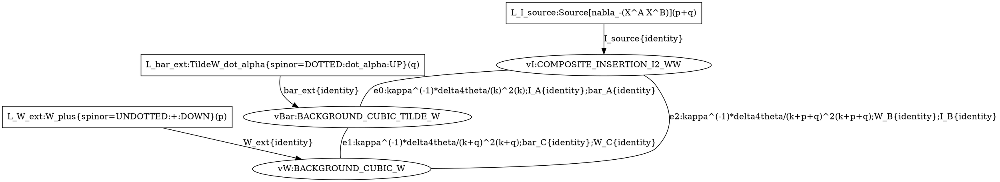
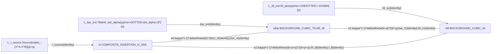

# WW_DIRECT_EXACT

## Completeness

$$
N_{\rm typed}=8,\qquad N_{\rm endpoint}=1,\qquad N_{\rm classes}=1.
$$

## A_WW_DIRECT_EXACT_001

$$
\mathcal A_G=\left(1\right)\left(1\right)\left(1\right)\prod_{f\in F_G^{\rm coefficient}} f,\qquad |\operatorname{Aut}G|=1\quad(\mathrm{audit\ only}),
$$

$$
C_G^{\rm raw}=-1/8*g2*g2*g2*h*h,\qquad C_G^{\rm Project}=-1/8*g2.
$$

| factor | category | exact expression | coefficient | origin |
|---|---|---|---|---|
| `F_wick` | `WICK_KOSZUL` | `1` | `1` | `scripts/step5_graph_ir.py:enumerate_wick_pairings` |
| `F_external_koszul` | `EXTERNAL_KOSZUL` | `1` | `1` | `contracts/foundations/step-05-euclidean-n4-awi-supergraphs.md:5.53a-5.53v; scripts/step5_ww_seed.py:physical_triangle` |
| `F_aut` | `AUTOMORPHISM_AUDIT_ONLY` | `\midAut(G)\mid=1` | `1` | `scripts/step5_supergraph_pipeline.py:graph_automorphism_order` |
| `F_iso_mult` | `ISOMORPHISM_CLASS_MULTIPLICITY` | `1` | `1` | `scripts/step5_supergraph_pipeline.py:compile_request` |
| `F_vertex_vI` | `INSERTION` | `COMPOSITE_INSERTION_I2_WW` | `1` | `contracts/foundations/step-05-euclidean-n4-awi-supergraphs.md:5.53a-5.53b` |
| `F_operator_vI_0` | `DERIVATIVE_OPERATOR` | `D_-[K_+V^A K_+V^B]` | `1` | `contracts/foundations/step-05-euclidean-n4-awi-supergraphs.md:5.53a-5.53b` |
| `F_operator_vI_1` | `DERIVATIVE_OPERATOR` | `K_+=-(1/8)D_+barD^2D_+` | `1` | `contracts/foundations/step-05-euclidean-n4-awi-supergraphs.md:5.53a-5.53b` |
| `F_delta_vI` | `VERTEX_DELTA` | `delta(k-(k+p+q)+(p+q))` | `1` | `contracts/foundations/step-05-euclidean-n4-awi-supergraphs.md:5.53a-5.53b` |
| `F_color_vI_0` | `COLOR_FLAVOR_TENSOR` | `A` | `1` | `contracts/foundations/step-05-euclidean-n4-awi-supergraphs.md:5.53a-5.53b` |
| `F_color_vI_1` | `COLOR_FLAVOR_TENSOR` | `B` | `1` | `contracts/foundations/step-05-euclidean-n4-awi-supergraphs.md:5.53a-5.53b` |
| `F_vertex_vBar` | `ACTION_VERTEX` | `BACKGROUND_CUBIC_TILDE_W` | `-1/8*i*h` | `contracts/foundations/step-05-euclidean-n4-awi-supergraphs.md:5.53e` |
| `F_operator_vBar_0` | `DERIVATIVE_OPERATOR` | `barD^dot_alpha(C)-barD^dot_alpha(A)` | `1` | `contracts/foundations/step-05-euclidean-n4-awi-supergraphs.md:5.53e` |
| `F_delta_vBar` | `VERTEX_DELTA` | `delta(-k+(k+q)-q)` | `1` | `contracts/foundations/step-05-euclidean-n4-awi-supergraphs.md:5.53e` |
| `F_color_vBar_0` | `COLOR_FLAVOR_TENSOR` | `c_{ACD}` | `1` | `contracts/foundations/step-05-euclidean-n4-awi-supergraphs.md:5.53e` |
| `F_vertex_vW` | `ACTION_VERTEX` | `BACKGROUND_CUBIC_W` | `1/8*i*h` | `contracts/foundations/step-05-euclidean-n4-awi-supergraphs.md:5.53e` |
| `F_operator_vW_0` | `DERIVATIVE_OPERATOR` | `D_a(C)-D_a(B)` | `1` | `contracts/foundations/step-05-euclidean-n4-awi-supergraphs.md:5.53e` |
| `F_delta_vW` | `VERTEX_DELTA` | `delta(-(k+q)+(k+p+q)-p)` | `1` | `contracts/foundations/step-05-euclidean-n4-awi-supergraphs.md:5.53e` |
| `F_color_vW_0` | `COLOR_FLAVOR_TENSOR` | `c_{BCE}` | `1` | `contracts/foundations/step-05-euclidean-n4-awi-supergraphs.md:5.53e` |
| `F_prop_e0` | `PROPAGATOR` | `kappa^(-1)*delta4theta/(k)^2` | `-2*g2` | `contracts/foundations/step-05-euclidean-n4-awi-supergraphs.md:5.46` |
| `F_prop_color_e0` | `COLOR_FLAVOR_TENSOR` | `kappa^{AB}` | `1` | `contracts/foundations/step-05-euclidean-n4-awi-supergraphs.md:5.46` |
| `F_prop_e1` | `PROPAGATOR` | `kappa^(-1)*delta4theta/(k+q)^2` | `-2*g2` | `contracts/foundations/step-05-euclidean-n4-awi-supergraphs.md:5.46` |
| `F_prop_color_e1` | `COLOR_FLAVOR_TENSOR` | `kappa^{AB}` | `1` | `contracts/foundations/step-05-euclidean-n4-awi-supergraphs.md:5.46` |
| `F_prop_e2` | `PROPAGATOR` | `kappa^(-1)*delta4theta/(k+p+q)^2` | `-2*g2` | `contracts/foundations/step-05-euclidean-n4-awi-supergraphs.md:5.46` |
| `F_prop_color_e2` | `COLOR_FLAVOR_TENSOR` | `kappa^{AB}` | `1` | `contracts/foundations/step-05-euclidean-n4-awi-supergraphs.md:5.46` |
| `F_loop_measure` | `LOOP_MEASURE` | `mu^(2 epsilon) d^d k/(2 pi)^d` | `1` | `contracts/foundations/step-05-euclidean-n4-awi-supergraphs.md:5.53a-5.53v; scripts/step5_ww_seed.py:physical_triangle` |
| `F_external_L_I_source` | `EXTERNAL_LEG` | `Source[nabla_-(X^A X^B)]` | `1` | `contracts/foundations/step-05-euclidean-n4-awi-supergraphs.md:5.53a-5.53v; scripts/step5_ww_seed.py:physical_triangle` |
| `F_external_L_bar_ext` | `EXTERNAL_LEG` | `TildeW_dot_alpha{spinor=DOTTED:dot_alpha:UP}` | `1` | `contracts/foundations/step-05-euclidean-n4-awi-supergraphs.md:5.53a-5.53v; scripts/step5_ww_seed.py:physical_triangle` |
| `F_external_L_W_ext` | `EXTERNAL_LEG` | `W_plus{spinor=UNDOTTED:+:DOWN}` | `1` | `contracts/foundations/step-05-euclidean-n4-awi-supergraphs.md:5.53a-5.53v; scripts/step5_ww_seed.py:physical_triangle` |

